--- 
title: "R-Practical"
author: "Pedro Cardoso"
site: bookdown::bookdown_site
output:
    bookdown::pdf_book:
        includes:
            in_header: header.tex
    bookdown::gitbook:
        config:
            sharing: null
        css: 'style.css'
        includes:
            in_header: _toggle.html
        keep_md: TRUE
linkcolor: blue
documentclass: book
link-citations: yes
description: "R-Practical"
---

# Opening


This file should contain written practicals for VIMC practicals.


<!--chapter:end:index.Rmd-->

# Programming Practical - P1

## Getting started

Start a new RStudio session, set your current working directory, open a new R Script and save this (blank) script to a file with an appropriate name.

Use this script file to edit and keep copies of the code you write in this practical: you may find it useful be able to look back later.

## Predicting the behaviour of for loops

We will use R to generate some data in the form of vectors and use these data to form some looping constructs. Predicting what code will do and testing your predictions by running the code should help cement your understanding of for loops.

Type the following code into your script. Remember that code after # is a comment and will be ignored by the R interpreter (you do not have to type these comments in for yourself, but you might want to if you think you will need to refer to them later).

<div class="panel panel-default"><div class="panel-heading"> Task </div><div class="panel-body"> 

```r
a <- 1:10           # Assign the integers 1 to 10 in order to the vector a
print(a)            # Print a to the screen
```

```
##  [1]  1  2  3  4  5  6  7  8  9 10
```

```r
b <- sample(a)      # Set b to be a with elements shuffled into random order
print(b)            # Print b to the screen
```

```
##  [1]  1 10  3  2  4  7  6  5  9  8
```
 </div></div>


Run the code a few times either by sourcing it or by highlighting it in the script then pressing the run button in RStudio.

You should note that:

- The first line creates a new vector a with the elements 1 to 10 in order
- The second line prints the vector a to the screen
- The third line uses a built-in R function to sample (all of) the elements of the vector a without replacement, i.e., to permute the elements into a different order, and assigns the result to the vector b
- The fourth line prints the vector b


### Example one

Write down what you expect the output of the following code to be before verifying your answer by entering the code into your script and running it.

<div class="panel panel-default"><div class="panel-heading"> Task </div><div class="panel-body"> 

```r
for (i in 1:10) {
    print(paste(i, a[i]))
}
```
 </div></div>

<button id="displayTextunnamed-chunk-4" onclick="javascript:toggle('unnamed-chunk-4');">Show: Solution</button>

<div id="toggleTextunnamed-chunk-4" style="display: none"><div class="panel panel-default"><div class="panel-heading panel-heading1"> Solution </div><div class="panel-body">
Prints numbers in order.

```
## [1] "1 1"
## [1] "2 2"
## [1] "3 3"
## [1] "4 4"
## [1] "5 5"
## [1] "6 6"
## [1] "7 7"
## [1] "8 8"
## [1] "9 9"
## [1] "10 10"
```
</div></div></div>

### Example two

Write down what you expect the output of the following code to be before verifying your answer by entering the code into your script and running it.

<div class="panel panel-default"><div class="panel-heading"> Task </div><div class="panel-body"> 

```r
for (i in 1:10) {
    print(paste(i, b[i]))
}
```
 </div></div>

<button id="displayTextunnamed-chunk-6" onclick="javascript:toggle('unnamed-chunk-6');">Show: Solution</button>

<div id="toggleTextunnamed-chunk-6" style="display: none"><div class="panel panel-default"><div class="panel-heading panel-heading1"> Solution </div><div class="panel-body">
Prints numbers in reverse order according to whatever is in sample b.

```
## [1] "1 1"
## [1] "2 10"
## [1] "3 3"
## [1] "4 2"
## [1] "5 4"
## [1] "6 7"
## [1] "7 6"
## [1] "8 5"
## [1] "9 9"
## [1] "10 8"
```
</div></div></div>

### Example three

Write down what you expect the output of the following code to be before verifying your answer by entering the code into your script and running it.

<div class="panel panel-default"><div class="panel-heading"> Task </div><div class="panel-body"> 

```r
for (i in a) {
    print(paste(i, b[i]))
}
```
 </div></div>

<button id="displayTextunnamed-chunk-8" onclick="javascript:toggle('unnamed-chunk-8');">Show: Solution</button>

<div id="toggleTextunnamed-chunk-8" style="display: none"><div class="panel panel-default"><div class="panel-heading panel-heading1"> Solution </div><div class="panel-body">
Prints numbers in forward order according to whatever is in sample b.

```
## [1] "1 1"
## [1] "2 10"
## [1] "3 3"
## [1] "4 2"
## [1] "5 4"
## [1] "6 7"
## [1] "7 6"
## [1] "8 5"
## [1] "9 9"
## [1] "10 8"
```
</div></div></div>


### Example four

Write down what you expect the output of the following code to be before verifying your answer by entering the code into your script and running it.

<div class="panel panel-default"><div class="panel-heading"> Task </div><div class="panel-body"> 

```r
for (i in sample(a)) {
    print(paste(i, b[i]))
}
```
 </div></div>

<button id="displayTextunnamed-chunk-10" onclick="javascript:toggle('unnamed-chunk-10');">Show: Solution</button>

<div id="toggleTextunnamed-chunk-10" style="display: none"><div class="panel panel-default"><div class="panel-heading panel-heading1"> Solution </div><div class="panel-body">
Prints numbers in random order from whatever is in sample b.

```
## [1] "7 6"
## [1] "8 5"
## [1] "6 7"
## [1] "5 4"
## [1] "4 2"
## [1] "10 8"
## [1] "1 1"
## [1] "9 9"
## [1] "3 3"
## [1] "2 10"
```
</div></div></div>

## Writing a for loop

Adapt the code from the lecture to use a for loop to do the following:

<div class="panel panel-default"><div class="panel-heading"> Task </div><div class="panel-body"> 

Print the 12 times table, i.e. produce output of the form

1 times 12 is 12

2 times 12 is 24
    
...
    
12 times 12 is 144
     </div></div>

<button id="displayTextunnamed-chunk-12" onclick="javascript:toggle('unnamed-chunk-12');">Show: Solution</button>

<div id="toggleTextunnamed-chunk-12" style="display: none"><div class="panel panel-default"><div class="panel-heading panel-heading1"> Solution </div><div class="panel-body">

```r
for (i in 1:12) {
    result <- i * 12
    print(paste(i, "times 12 is", result))
}
```

```
## [1] "1 times 12 is 12"
## [1] "2 times 12 is 24"
## [1] "3 times 12 is 36"
## [1] "4 times 12 is 48"
## [1] "5 times 12 is 60"
## [1] "6 times 12 is 72"
## [1] "7 times 12 is 84"
## [1] "8 times 12 is 96"
## [1] "9 times 12 is 108"
## [1] "10 times 12 is 120"
## [1] "11 times 12 is 132"
## [1] "12 times 12 is 144"
```
</div></div></div>

## Writing a while loop

Repeat the previous task using a while loop.

<div class="panel panel-default"><div class="panel-heading"> Task </div><div class="panel-body"> 

Print the 12 times table, i.e. produce output of the form

1 times 12 is 12

2 times 12 is 24
    
...
    
12 times 12 is 144
     </div></div>

<button id="displayTextunnamed-chunk-14" onclick="javascript:toggle('unnamed-chunk-14');">Show: Solution</button>

<div id="toggleTextunnamed-chunk-14" style="display: none"><div class="panel panel-default"><div class="panel-heading panel-heading1"> Solution </div><div class="panel-body">

```r
i <- 1
while(i <= 12) {
  result <- i * 12
  print(paste(i, "times 12 is", result))
  i <- i + 1
}
```

```
## [1] "1 times 12 is 12"
## [1] "2 times 12 is 24"
## [1] "3 times 12 is 36"
## [1] "4 times 12 is 48"
## [1] "5 times 12 is 60"
## [1] "6 times 12 is 72"
## [1] "7 times 12 is 84"
## [1] "8 times 12 is 96"
## [1] "9 times 12 is 108"
## [1] "10 times 12 is 120"
## [1] "11 times 12 is 132"
## [1] "12 times 12 is 144"
```
</div></div></div>


## Using loops to do more complex calculations

### A loop for which the number of iterations is known in advance

Enter the following code to your script and check you understand the output.


```r
p <- 4
print(2^p)
p <- 5
print(p^3)
```

Now write code to answer the following question.


<div class="panel panel-default"><div class="panel-heading"> Task </div><div class="panel-body"> 

What is the sum of the first 15 powers of 2 (i.e. 2^1^ + 2^2^ + ... 2^15^)?
     </div></div>

<button id="displayTextunnamed-chunk-17" onclick="javascript:toggle('unnamed-chunk-17');">Show: Solution</button>

<div id="toggleTextunnamed-chunk-17" style="display: none"><div class="panel panel-default"><div class="panel-heading panel-heading1"> Solution </div><div class="panel-body">

```r
runningSum <- 0
for(i in 1:15) {
  runningSum <- runningSum + 2^i
}
print(paste("Sum is",runningSum))
```

```
## [1] "Sum is 65534"
```

Note you can do the above more efficiently, e.g. `sum(2^(1:15))`
</div></div></div>


### A loop for which the number of iterations is not know in advance

Write code to answer the following question.

<div class="panel panel-default"><div class="panel-heading"> Task </div><div class="panel-body"> 

What is the smallest power of 2 that is greater than 1000000?
     </div></div>

<button id="displayTextunnamed-chunk-19" onclick="javascript:toggle('unnamed-chunk-19');">Show: Solution</button>

<div id="toggleTextunnamed-chunk-19" style="display: none"><div class="panel panel-default"><div class="panel-heading panel-heading1"> Solution </div><div class="panel-body">

```r
thisIDX <- 1
thisPower <- 2^thisIDX
while(thisPower<1000000) {
  thisIDX <- thisIDX + 1
  thisPower <- 2^thisIDX
}
print(paste("2^",thisIDX,"=",thisPower,sep=""))
```

```
## [1] "2^20=1048576"
```
</div></div></div>


## Writing simple functions

Type the following code into your script and run it.

Before you run it, think about whether you expect any output.


```r
sayHello <- function() {
    print("Hello")
}
```

Type the following at the command prompt, but before you do so, predict what will happen.


```r
sayHello()
```

Now type the following code into your script.


```r
sayHelloWithArg <- function(whoTo) {
    print(paste("Hello", whoTo))
}
```

<div class="panel panel-default"><div class="panel-heading"> Task </div><div class="panel-body"> 

Now type each of the following instructions into the command prompt.

Before typing each line, predict what will happen.

```r
sayHelloWithArg()

sayHelloWithArg 

sayHelloWithArg("nik")

sayHello("nik")

sayHelloWithArg(nik) 

sayHelloWithArg(whoto="nik") 

sayHelloWithArg(whoTo="nik")
```
 </div></div>

<button id="displayTextunnamed-chunk-24" onclick="javascript:toggle('unnamed-chunk-24');">Show: Solution</button>

<div id="toggleTextunnamed-chunk-24" style="display: none"><div class="panel panel-default"><div class="panel-heading panel-heading1"> Solution </div><div class="panel-body">

```r
sayHelloWithArg()       # error, since not passed argument

sayHelloWithArg         # echos function's code to screen (happens in general if type function's name without brackets)

sayHelloWithArg("nik")  # works as expected

sayHello("nik")         # error, since too many arguments for the simpler function

sayHelloWithArg(nik)    # error, since variable nik is not defined

sayHelloWithArg(whoto="nik") # error, since argument names are case sensitive

sayHelloWithArg(whoTo="nik") # works as expected
```
</div></div></div>

## Predicting the behaviour of a function

For now, do not type in the following code, but instead just read it.


```r
cat <- 2
canary <- 4
buster <- function(cat, canary) { 
  cat <- cat*2 
  canary <- canary*3
  return(cat + canary) 
}

ghost = buster(canary, -cat)
```

<div class="panel panel-default"><div class="panel-heading"> Task </div><div class="panel-body"> 

Think carefully about what you expect the values of cat, canary and ghost to be after this code is executed and write down your answer.
 </div></div>

Now execute the code and test your prediction.

<button id="displayTextunnamed-chunk-27" onclick="javascript:toggle('unnamed-chunk-27');">Show: Solution</button>

<div id="toggleTextunnamed-chunk-27" style="display: none"><div class="panel panel-default"><div class="panel-heading panel-heading1"> Solution </div><div class="panel-body">
The line `ghost = buster(canary, -cat)` sets ghost to be 2, but leaves cat and canary unchanged.</div></div></div>

## Return values from functions

The code in the box below does the following.

- Defines a function `mySum` that returns the sum of a vector
- Creates a vector `x` containing 100 uniform random numbers between 0 and 1
- Finds their sum using `mySum`
- Finds their sum using the built-in R function `sum`
- Prints out a comparison of the two values

Type the code into your script and make sure you are happy with how it works.


```r
mySum <- function(toSum) { # my function to sum elements of a vector
  retVal <- 0
  for(i in 1:length(toSum))
  { 
    retVal <- retVal + toSum[i]  
  } 
  return(retVal)
} 

a <- runif(100)     # generate 100 uniform random numbers 
myWay <- mySum(a)   # calculate sum using our mySum() function
rWay <- sum(a)      # calculate sum using built-in sum() function 
print(paste("My answer", myWay, "... R answer", rWay))
```

<div class="panel panel-default"><div class="panel-heading"> Task </div><div class="panel-body"> 

Use the function `mySum` as a base to write a new function `mySumAndMean`.

The new function should calculate the sum and the mean of whatever vector it receives as an input. It should return a vector: the first element of the output vector should be the sum, the second the mean. You might find the built-in function mean helpful to test your code.
 </div></div>

<button id="displayTextunnamed-chunk-30" onclick="javascript:toggle('unnamed-chunk-30');">Show: Solution</button>

<div id="toggleTextunnamed-chunk-30" style="display: none"><div class="panel panel-default"><div class="panel-heading panel-heading1"> Solution </div><div class="panel-body">

```r
mySumAndMean <- function(toSum) { # my function to sum elements of a vector and return that and the mean
  retVal <- 0
  for(i in 1:length(toSum))
  { 
    retVal <- retVal + toSum[i]  
  } 
  meanVal <- retVal/length(toSum) # find the mean, too
  return(c(retVal,meanVal))       # return two values by wrapping up into vector
} 
```
</div></div></div>


## Additional tasks for those with programming experience

The following tasks are mainly aimed at those of you who already have experience in programming.

### Extended example one: Monte Carlo simulation

When I was younger, I sometimes collected Panini football stickers.

The basic idea is very simple: you collect numbered stickers to stick into an album, continuing to buy stickers until you have the full set. The problem is that you don’t know which stickers you are going to get until you open a packet. Each packet contains a random sample of the available stickers, and packets are sealed at the time of purchase. This means that as you get closer and closer to completing the album, it becomes more and more unlikely that any new packet will contain any stickers you need for your album.

At the time, it was a matter of significant regret for me that I never did complete the album for the Mexico ’86 World Cup. That album required a total of 427 stickers.

Now, better trained in mathematics and computing, I wondered how many stickers I might have had to buy to be successful in my quest to complete the album.

We are going to write a simple “Monte Carlo” simulation to understand this. Monte Carlo simulations rely on random sampling to obtain an estimate of a random variable. You will be writing Monte Carlo simulations of stochastic epidemic models later in the course, so this is good practice.

We remove some of the complexity by considering a slightly simpler situation, in which stickers come in packets of one.

Note the built-in R function `sample` that was introduced earlier can in fact be called in other ways. Type the following into the command line and run it a few times


```r
sample(1:200,3)
```

You should see that – when it is called with two arguments – the built-in R function `sample` no longer merely shuffles the whole of the vector that is its first argument, but instead randomly samples the number of elements given by the second argument from that vector (again without replacement). The above corresponds to randomly choosing a three numbers from the list of integers between 1 and 200.

Furthermore, note the behaviour of the built-in R function `rep` by typing the following in at the command line


```r
rep(TRUE,4)
```

You should see that this line of code creates a vector of length 4 where all four elements are the logical value `TRUE`.

One way of writing a simulation of a single attempt to collect the entire album would be something like the code that follows. **However, this code contains a deliberate mistake.**


<div class="panel panel-default"><div class="panel-heading"> Task </div><div class="panel-body"> 

Enter the code into your script, find the mistake, fix it, and run the code.

```r
totStickers <- 427
gotSticker <- rep(FALSE,totStickers)
numLeft <- totStickers
numStickersBought <- 0
while(numLeft > 0) {
  numStickersBought <- numStickersBought + 1
  thisSticker <- sample(1:totStickers,1)
  if(gotSticker[thisSticker]==TRUE) {
    gotSticker[thisSticker] <- TRUE
    numLeft <- numLeft - 1
    print(paste('got', thisSticker, 'still need',numLeft))
  }
}
print(paste('bought', numStickersBought))
```
 </div></div>


<button id="displayTextunnamed-chunk-34" onclick="javascript:toggle('unnamed-chunk-34');">Show: Solution</button>

<div id="toggleTextunnamed-chunk-34" style="display: none"><div class="panel panel-default"><div class="panel-heading panel-heading1"> Solution </div><div class="panel-body">

There is a mistake in the code on line 8. The condition in the `if` statement should be checking for `FALSE`, not `TRUE`.
</div></div></div>

Each time you run the fixed version of the code should lead to a different result. You can get an estimate of the average number of stickers that is required to complete the album by running the code lots of times, and averaging the result.

<div class="panel panel-default"><div class="panel-heading"> Task </div><div class="panel-body"> 

Add a for loop around the code above to run 100 simulations of collecting an entire album, storing the number of stickers required in each simulation in a vector. Apply the function built-in R function `mean` to the vector to estimate the average number of stickers that must be bought to complete the album.
 </div></div>

<button id="displayTextunnamed-chunk-36" onclick="javascript:toggle('unnamed-chunk-36');">Show: Solution</button>

<div id="toggleTextunnamed-chunk-36" style="display: none"><div class="panel panel-default"><div class="panel-heading panel-heading1"> Solution </div><div class="panel-body">

```r
myEstimates <- numeric(0)
numRuns <- 100
for(i in 1:numRuns) {
  totStickers <- 427
  gotSticker <- rep(FALSE,totStickers)
  numLeft <- totStickers
  numStickersBought <- 0
  while(numLeft > 0) {
    numStickersBought <- numStickersBought + 1
    thisSticker <- sample(1:totStickers,1)
    if(gotSticker[thisSticker]==FALSE) {     # this is the line which had an error (fixed here)
      gotSticker[thisSticker] <- TRUE
      numLeft <- numLeft - 1
  #   commented out the following print statement to save time
  #   print(paste('got', thisSticker, 'still need',numLeft))
    }
  }
  print(paste("Run",i,"bought", numStickersBought))
  myEstimates[i] <- numStickersBought
}
```

```
## [1] "Run 1 bought 2892"
## [1] "Run 2 bought 3987"
## [1] "Run 3 bought 2626"
## [1] "Run 4 bought 3780"
## [1] "Run 5 bought 2280"
## [1] "Run 6 bought 3211"
## [1] "Run 7 bought 3078"
## [1] "Run 8 bought 2661"
## [1] "Run 9 bought 3480"
## [1] "Run 10 bought 2651"
## [1] "Run 11 bought 2900"
## [1] "Run 12 bought 3301"
## [1] "Run 13 bought 2793"
## [1] "Run 14 bought 2242"
## [1] "Run 15 bought 2798"
## [1] "Run 16 bought 2489"
## [1] "Run 17 bought 3094"
## [1] "Run 18 bought 3684"
## [1] "Run 19 bought 2588"
## [1] "Run 20 bought 2947"
## [1] "Run 21 bought 2918"
## [1] "Run 22 bought 2581"
## [1] "Run 23 bought 4000"
## [1] "Run 24 bought 3198"
## [1] "Run 25 bought 3811"
## [1] "Run 26 bought 2935"
## [1] "Run 27 bought 2673"
## [1] "Run 28 bought 3214"
## [1] "Run 29 bought 2566"
## [1] "Run 30 bought 2471"
## [1] "Run 31 bought 2457"
## [1] "Run 32 bought 2582"
## [1] "Run 33 bought 2490"
## [1] "Run 34 bought 2443"
## [1] "Run 35 bought 2642"
## [1] "Run 36 bought 3243"
## [1] "Run 37 bought 3039"
## [1] "Run 38 bought 2886"
## [1] "Run 39 bought 3610"
## [1] "Run 40 bought 3230"
## [1] "Run 41 bought 2301"
## [1] "Run 42 bought 2173"
## [1] "Run 43 bought 2931"
## [1] "Run 44 bought 1967"
## [1] "Run 45 bought 2369"
## [1] "Run 46 bought 2550"
## [1] "Run 47 bought 2491"
## [1] "Run 48 bought 3804"
## [1] "Run 49 bought 2308"
## [1] "Run 50 bought 3164"
## [1] "Run 51 bought 3037"
## [1] "Run 52 bought 2091"
## [1] "Run 53 bought 2185"
## [1] "Run 54 bought 2114"
## [1] "Run 55 bought 2097"
## [1] "Run 56 bought 2524"
## [1] "Run 57 bought 2284"
## [1] "Run 58 bought 3062"
## [1] "Run 59 bought 2274"
## [1] "Run 60 bought 2605"
## [1] "Run 61 bought 4299"
## [1] "Run 62 bought 2429"
## [1] "Run 63 bought 3046"
## [1] "Run 64 bought 2396"
## [1] "Run 65 bought 2734"
## [1] "Run 66 bought 3590"
## [1] "Run 67 bought 2084"
## [1] "Run 68 bought 3595"
## [1] "Run 69 bought 2993"
## [1] "Run 70 bought 2261"
## [1] "Run 71 bought 3571"
## [1] "Run 72 bought 2664"
## [1] "Run 73 bought 2640"
## [1] "Run 74 bought 2755"
## [1] "Run 75 bought 2367"
## [1] "Run 76 bought 2228"
## [1] "Run 77 bought 2338"
## [1] "Run 78 bought 2522"
## [1] "Run 79 bought 2204"
## [1] "Run 80 bought 2745"
## [1] "Run 81 bought 2896"
## [1] "Run 82 bought 2397"
## [1] "Run 83 bought 2800"
## [1] "Run 84 bought 2173"
## [1] "Run 85 bought 3001"
## [1] "Run 86 bought 2616"
## [1] "Run 87 bought 2746"
## [1] "Run 88 bought 2822"
## [1] "Run 89 bought 3164"
## [1] "Run 90 bought 3090"
## [1] "Run 91 bought 2343"
## [1] "Run 92 bought 3609"
## [1] "Run 93 bought 4124"
## [1] "Run 94 bought 1883"
## [1] "Run 95 bought 2332"
## [1] "Run 96 bought 3085"
## [1] "Run 97 bought 3552"
## [1] "Run 98 bought 3173"
## [1] "Run 99 bought 2682"
## [1] "Run 100 bought 3427"
```

```r
hist(myEstimates)
```


```r
mean(myEstimates)
```

```
## [1] 2821.78
```
</div></div></div>

The expected value (i.e. mean) number of stickers that is required to complete an album of 427 stickers is in fact $427 \times H_{427}$, where $H_{427}$ is the 427$^{th}$ Harmonic number (the mathematics of this is explained in the appendix).

It turns out that $H_{427} \approx 6.635$, and so the estimated mean is about 2,800 or so. This is a lot of stickers! The requisite number would be reduced in practice, because you are able swap duplicate stickers with your friends, as well as send off to Panini on a special form for a maximum of 50 stickers towards the end, but nevertheless, this simulation has explained my disappointment as a 9-year-old child!


### Extended example two: the logistic map

The logistic map is a simple population model in discrete-time, and relates the size of a population in generation n+1 to its size in generation n. It is one of the simplest models that shows “chaotic” behaviour.

One way of writing the logistic map is via the following recurrence $$x_{n+1} = rx_{n}(1-x_{n}) $$ where $x_{n}$ is the population size in year $n$, measured as a fraction of the carrying capacity, and $r$ is the intrinsic rate of increase (a growth rate).

<div class="panel panel-default"><div class="panel-heading"> Task </div><div class="panel-body"> 

What do you think is the purpose of the following function?

```r
logisticValues <- function(r,N,x0) { 
  retVal <- numeric(N)
  thisX <- x0
  for(i in 1:N) { 
    thisX <- r * thisX * (1 - thisX)
    retVal[i] <- thisX 
  }
  return(retVal) 
} 
```
 </div></div>

<button id="displayTextunnamed-chunk-38" onclick="javascript:toggle('unnamed-chunk-38');">Show: Solution</button>

<div id="toggleTextunnamed-chunk-38" style="display: none"><div class="panel panel-default"><div class="panel-heading panel-heading1"> Solution </div><div class="panel-body">

The given function returns $N$ iterates of the logistic map starting at $x_0$ (note, does not store initial value)
</div></div></div>

Include the function `logisticValues` in your script.

Also include the following code that uses the function to plot a graph.


```r
r <- 1.5        # growth rate
N <- 100        # max generation
x0 <- 0.01      # initial value
xn <- logisticValues(r,N,x0)  # next N starting at x0 
plot(0:N,c(x0,xn),type='o',xlab='n',ylab='x_n')  # plot
```

<div class="panel panel-default"><div class="panel-heading"> Task </div><div class="panel-body"> 

Try running the code for different values of r. What does the graph show you?
 </div></div>

<button id="displayTextunnamed-chunk-41" onclick="javascript:toggle('unnamed-chunk-41');">Show: Solution</button>

<div id="toggleTextunnamed-chunk-41" style="display: none"><div class="panel panel-default"><div class="panel-heading panel-heading1"> Solution </div><div class="panel-body">
This code shows the behaviour of the logistic map with $r = 1.5$ for 100 generations. Note the slightly clunky way of making sure the initial point is returned.

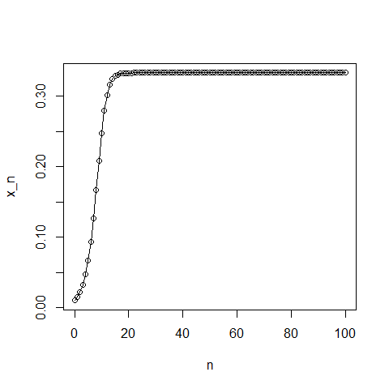
</div></div></div>
Good values of $r$ to try would be $r = 0.5$, $r = 1.5$, $r = 2.5$, $r = 3.1$, $r = 3.5$, $r = 3.7$. You should also test the behaviour for different initial conditions: suitable values would be $x_{0} = 0.01$ and $x_{0} = 0.1$.

<div class="panel panel-default"><div class="panel-heading panel-heading2"> Note: </div><div class="panel-body"> 
As you change the value of $r$ in the above code the system goes from having a single equilibrium in the long term, to oscillating between a pair of values, to oscillating between four values. By $r = 3.7$, the trajectory depends very sensitively to the initial value $x0$ (as is demonstrated by the below code). This is called deterministic chaos. </div></div>

You should note that in the case $r = 3.7$, the pattern of successive population sizes appears to be fairly random. It also depends on the initial value of $x0$.

The following code confirms this (note the first five lines are almost exactly as they were before): include this code in your script to check this.


```r
r <- 3.7            # growth rate
N <- 100            # max generation
x0 <- 0.01          # initial value
xn <- logisticValues(r,N,x0)    # next N starting at x0
plot(0:N,c(x0,xn),type='o',xlab='n',ylab='x_n') # plot 
x0 <- 0.01001       # different initial value
xn <- logisticValues(r,N,x0)    # next N starting there
lines(0:N,c(x0,xn),type='o',col='red') # overlay on plot
```


Notice that, despite starting very close together, the trajectories diverge over time. “Sensitive dependence on initial conditions” is characteristic of deterministic chaos.

<div class="panel panel-default"><div class="panel-heading"> Task </div><div class="panel-body"> 

What do you think the following code does?

Test your understanding by typing the function in and running it by issuing an appropriate call to the function at the command prompt.

```r
logisticValuesAfterBurnIn <- function(r,N,M,x0) { 
  retVal <- numeric(M)
  thisX <- x0
  for(i in 1:N) { 
    thisX <- r * thisX * (1 - thisX)
  }
  for(i in 1:M) { 
    thisX <- r * thisX * (1 - thisX)
    retVal[i] <- thisX 
  }
  return(retVal) 
} 
```
 </div></div>

<button id="displayTextunnamed-chunk-45" onclick="javascript:toggle('unnamed-chunk-45');">Show: Solution</button>

<div id="toggleTextunnamed-chunk-45" style="display: none"><div class="panel panel-default"><div class="panel-heading panel-heading1"> Solution </div><div class="panel-body">
The given code performs $N$ iterations of the logistic map starting from $x_0$ but does not store them. It then calculates, stores and returns the following $M$ iterations of the logistic map.</div></div></div>

Enter the following code and run it.


```r
rVals <- seq(2.5,4,by=0.005)
plot(c(2.5,4),c(0,1),type='n',xlab='r',ylab='orbit')
for(r in rVals) { 
  N <- 1000     
  M <- 100 
  xn <- logisticValuesAfterBurnIn(r,N,M,0.01)   
  points(rep(r,M),xn,pch=19,cex=0.01)
} 
```


<div class="panel panel-default"><div class="panel-heading"> Task </div><div class="panel-body"> 

What happens?

Do you understand what the plot -- a so-called “bifurcation diagram” -– is showing?
     </div></div>

<button id="displayTextunnamed-chunk-48" onclick="javascript:toggle('unnamed-chunk-48');">Show: Solution</button>

<div id="toggleTextunnamed-chunk-48" style="display: none"><div class="panel panel-default"><div class="panel-heading panel-heading1"> Solution </div><div class="panel-body">
The key idea is that - for each value of $r$ - it calculates $N=1000$ iterations of the map, but totally ignores them. It then plots the values of the next 100 iterations (as the y-value on a graph which has the value of $r$ as the x-ordinate). The idea behind all this is to let the system equilibriate - if it is ever going to do so. So from the bifurcation diagram you can see from this picture that there is/are:
    
- a single equilibrium for $2.5 < r < 3.0$
- two equilibria for $3.0 < r < 3.45$ (-ish)
- four equilibria for $3.45$(-ish) $< r < 3.54$ (-ish)
- by $r \sim 3.57$, we have chaos (as seen in plots for different starting conditions above) which here corresponds to a more or less random - although lying within certain bounds - set of 100 points plotted for each $r$

This is explained well on the relevant [wikipedia page](https://en.wikipedia.org/wiki/Logistic_map#Behavior_dependent_on_r)</div></div></div>

A very readable introduction to deterministic chaos in biology is given by May (1976) (“Simple mathematical models with very complicated dynamics”. Nature 261: 459-467). That article is widely available online and comes highly recommended.


## Appendix: relating sticker collecting to the harmonic numbers

In the lecture I claimed that the example of collecting things is somehow related to the harmonic series. To see this does not require sophisticated mathematics. 

If there are a total of $N$ stickers, of which you have already collected $M$, the probability of a new sticker being one you “need” is $p_{M} = (N-M)/N$. Assuming that successive purchases are independent, the number of stickers that must be bought to get a sticker you need when you already have $M$ stickers in your album would follow a geometric probability distribution^[You will be reminded of basic facts about probability distributions in a forthcoming lecture. Note the expected number is quite intuitive: as a simple example, consider rolling a dice until you get a six. The probability of getting a six is $\frac{1}{6}$: hopefully it seems reasonable that you should have to roll the dice an average of 6 times to get one. That’s all that is happening here, just written in symbols.]. The expected number of stickers needed to get the $M^{th}$ sticker is therefore $\frac{1}{p_{M}}$.

The number of stickers that you must buy to complete the entire album is then just the expected number of stickers to get the first sticker in your album (i.e. when you have already got 0), plus the expected number required for your second sticker (i.e. when you have already got 1), ..., all the way up to the expected number to get the final sticker (i.e. when you have already got $N – 1$).

Therefore $$\text{Average number of stickers required} = \frac{1}{p_{0}} + \frac{1}{p_{1}} + \text{... } +\frac{1}{p_{N-1}}.$$

However (by the definition of $p_{M}$) this reduces to $$\begin{aligned} \text{Average number of stickers required} &= \frac{N}{N} + \frac{N}{N-1} + \text{... } + \frac{N}{1} \\ &=N\left(\frac{N}{N} + \frac{N}{N-1} + \text{... } + \frac{1}{1}\right) \\ &=N\left(1 + \text{... } + \frac{1}{N-1} + \frac{1}{N}\right) \\ &=N \times H_{N}\end{aligned} $$

where we reversed the order of the sum in going from line 2 to line 3, and have used the definition of the $N^{th}$ harmonic number (see lecture slides) on line 4.


<!--chapter:end:Materials/Programming/Programmingchp-P1.Rmd-->

# Programming Practical - P2

## Random variables

A random variable can be thought of as the outcome of an experiment or a measurement i.e. something that can change each time you look at it.

Examples:

- The number of heads you obtain when tossing a coin 10 times
- The number of emails you received in one hour
- The lifetime of a light-bulb
- The length of time an individual is infected for before recovering

## Probability distributions

A probability distribution will tell us the probability of a random variable taking a specific value.

A Binomial Distribution will be able to give us the probability of obtaining $x$ heads if we toss a coin 10 times (where $x$ is any number).


```r
plot(
  x = 0:10,
  y = dbinom(0:10, 10, prob = 0.5),
  type = "h",
  main = "Binomial Probability \nMass Function",
  xlab = "Number of Heads",
  ylab = "Probability"
)
```


This is an example of a discrete random variables, and so the distribution is called **probability mass function**.

For continuous random variables we can only calculate the probability of being in an interval.

A Normal Distribution will be able to gives us the probability of measurement errors, $x$, being a certain size.


```r
plot(
  x = seq(-3, 3, length = 100),
  y = dnorm(seq(-3, 3, length = 100), mean = 0, sd = 1),
  type = "l",
  main = "Normal Probability \nDensity Function",
  xlab = "x",
  ylab = "Probability Density"
)
```

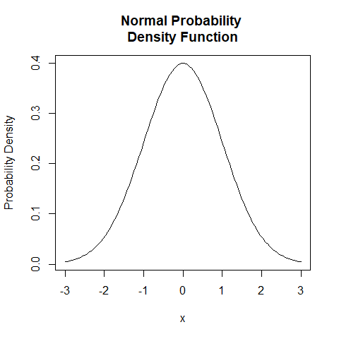

This is an example of a continuous random variable, and so the distribution is called a **probability density function**.

## Using probability distributions in R - types

R has a large number of inbuilt probability distributions.

Discrete distributions:

- Binomial
- Geometric
- Poisson
- Negative Binomial
- Hypergeometric
- Multinomial

Continuous distributions:

- Normal
- Uniform
- T (T-test)
- F (F-test)
- Exponential
- Cauchy
- Beta
- Gamma
- Weibull
- Chi-squared
- Logistic

R deals with them all in essentially the same way. Each inbuilt distribution in R is referred to by its abbreviation.

- Binomial: `binom`
- Poisson: `pois`
- Geometric: `geom`
- Normal: `norm`
- Uniform: `unif`
- Exponential: `exp`
- ...

Each inbuilt distribution in R has the same four generic functions associated with it.

For a distribution with abbreviation `dist`:

- `ddist()`: density/mass function
- `pdist()`: cumulative density/mass function
- `rdist()`: random number generator function
- `qdist()`: quantile function

### `ddist()`

For a distribution type `dist`, the function `ddist(x,...)` returns:

- The probability $P(X=x)$ (for discrete variables) or
- The probability density at $x$ (for continuous variables)

This can be used to calculate actual probabilities for discrete distributions.

#### `dbinom()` - discrete distribution

Consider a Binomial Distribution with 10 trials, each with a probability of success of 0.5. The R function `dbinom()` describes the distribution of the probability of success.

It takes the following arguments:

- $x$: the number of successful trials
- size: the total number of trials
- prob: the probability of success


```r
dbinom(4, 10, 0.5)
```

```
## [1] 0.2050781
```

Or to plot the distribution itself.


```r
dbinom(0:10, 10, 0.5)
```

```
##  [1] 0.0009765625 0.0097656250 0.0439453125 0.1171875000 0.2050781250
##  [6] 0.2460937500 0.2050781250 0.1171875000 0.0439453125 0.0097656250
## [11] 0.0009765625
```

```r
plot(0:10, dbinom(0:10, 10, 0.5), type = "h", xlab = "x", ylab = "Probability Density")
```


#### `dnorm()` - continuous distribution

Consider a Normal Distribution with mean 0 and standard deviation 1.

The R function `dnorm()` gives the probability density at a given value of $x$.

It takes the following arguments:

- $x$
- mean
- sd: standard deviation

The function `dnorm(x, mean, sd)` isn't useful in itself but is useful for plotting. 

With a continuous distribution we have to choose the $x$ coordinates close enough together to approximate a smooth curve.


```r
x <- seq(-4, 4, 0.01)
plot(x, dnorm(x, 0, 1), type = "l", xlab = "x", ylab = "Probability Density")
```

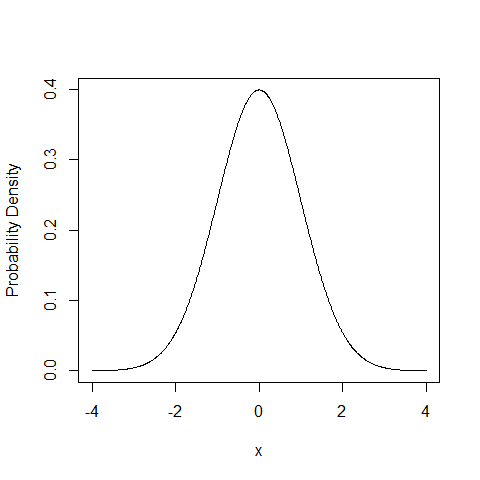

### `pdist()`

For a distribution dist `pdist(x, ...)` returns the probability $P(X\le x)$ (which in a continuous function is an actual probability).

#### `pnorm()` - probability calculations

If we want to find the probability of having a value below $-1$ from a Normal Distribution we use `pnorm()`.


```r
pnorm(-1, 0, 1)
```

```
## [1] 0.1586553
```


If we want to find the probability of having a value between $-1$ and $1.5$ from a Normal Distribution we use `pnorm()`.


```r
pnorm(1.5, 0, 1) - pnorm(-1, 0, 1)
```

```
## [1] 0.7745375
```


### `rdist()`

For a distribution dist `rdist()` returns $n$ random numbers drawn from that distribution.

This function is of great use when trying to run stochastic models. The ability to draw random numbers from many different types of distribution is incredibly useful.

### `rnorm()` - Normal Distribution

Consider a Normal Distribution with mean and standard deviation.

The R function `rnorm()` returns random numbers drawn from this distribution.

It takes the following arguments:

- $n$: number of random numbers to return
- mean
- sd: standard deviation


```r
norm.dat <- rnorm(5, 0, 1)
print(norm.dat)
```

```
## [1]  0.04816033  0.37308178 -0.33625093 -1.72855767 -0.55866863
```

Consider a Normal Distribution with mean 0 and variable 1. We will draw thousands of random numbers from this distribution and plot a histogram of them. This should then look like the theoretical Normal Distribution curve we produce with `dnorm()`.


```r
norm.dat <- rnorm(50000, 0, 1)
hist(norm.dat, prob = T, breaks = 50, xlab = "x")
x <- seq(-4, 4, 0.01)
lines(x, dnorm(x, 0, 1), col = "red")
```


## Example one - using probabilities for simulation

Consider tossing a biased coin. There are two outcomes: Heads or Tails.

$P(H) = \frac{1}{3}$ \& $P(T) = \frac{2}{3}$

How can we use probability distributions in R to simulate this?

### Binomial Distribution

Using the Binomial Distribution:

- 1 observation
- 1 trial
- Probability of success (H) is $\frac{1}{3}$


```r
rbinom(
  1,  # number of observation
  1,  # number of binomial trials
  1/3 # binomial probability of success
)
```

```
## [1] 1
```

`rbinom()` returns the number of successes from our 1 observation of tossing a biased coin once.

- 0: $\frac{2}{3}$ of the time
- 1: $\frac{1}{3}$ of the time

We can check this by getting R to do many observations at once...


```r
rbinom(15, 1, 1/3)
```

```
##  [1] 1 0 1 1 0 1 0 0 0 0 0 1 0 0 1
```

### Normal Distribution

Using the Normal Distribution:

Generate single number uniformly between 0 and 1.


```r
rand <- runif(
  1,  # number of observation
  0,  # minimum
  1   # maximum
)
if (rand < 1/3) {
    print("Heads")
} else {
    print("Tails")
}
```

```
## [1] "Heads"
```

```r
print(rand) # confirm by printing rand
```

```
## [1] 0.1177264
```

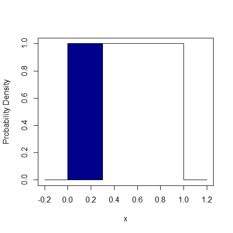

The shaded area corresponds to the probability of drawing Heads.

## Example two - multiple choices

Consider tossing a very thick biased coin. There are three outcomes: Heads, Tails, or edge.

- $P(H) = \frac{3}{10}$
- $P(T) = \frac{6}{10}$
- $P(E) = \frac{1}{10}$

<div class="panel panel-default"><div class="panel-heading"> Task </div><div class="panel-body"> 
How can we use probability distributions in R to simulate this? </div></div>


```r
rand <- runif(1, 0, 1)
if (rand < 3/10) {
    print("Heads") 
} else if (rand < 9/10) {
    print("Tails")
} else {
    print("Edge")
}
```

```
## [1] "Tails"
```

```r
print(rand) # confirm by printing rand
```

```
## [1] 0.6496403
```


The blue shaded area corresponds to the probability of drawing Heads. The red shaded area corresponds to the probability of drawing Tails. The unshaded area corresponds to the probability of drawing Edge.


## Exercise one - using R to model a die

Consider a regular six-sided die.

<div class="panel panel-default"><div class="panel-heading"> Task </div><div class="panel-body"> 

How could we simulate a single throw of a die?
    
- What are the possible outcomes?
- Use `runif()`
- Use (lots of) `if else` statements
 </div></div>

<button id="displayTextunnamed-chunk-68" onclick="javascript:toggle('unnamed-chunk-68');">Show: Solution</button>

<div id="toggleTextunnamed-chunk-68" style="display: none"><div class="panel panel-default"><div class="panel-heading panel-heading1"> Solution </div><div class="panel-body">

```r
rand <- runif(1, 0, 1)
if (rand < 1/6) {
    print(1)
} else if (rand < 2/6) {
    print(2)
} else if (rand < 3/6) {
    print(3)
} else if (rand < 4/6) {
    print(4)
} else if (rand < 5/6) {
    print(5)
} else {
    print(6)
}
```

```
## [1] 2
```
</div></div></div>


## Example three - using R to model a death process stochastically

Consider a population of animals. Every year each animal has a fixed probability of dying (depressing I know!), independently of each other and how old they are. There are no new animals born.

<div class="panel panel-default"><div class="panel-heading"> Task </div><div class="panel-body"> 

How could we model this?
     </div></div>

- Need a program that keeps track of number of live animals
- At each time step, we need to 'roll a die' to see if each live animal survives
- We update the numbers of live animals and keep going until everything dies!

This is easy to do in R.


```r
nAlive <- 100                       # current number of live animals
max.time <- 200                     # keep going for up to 200 steps
nAliveStore <- numeric(max.time+1)  # vector to store how many were alive at each step
nAliveStore[1] <- nAliveStore       # store how many were alive at the start
```

```
## Warning in nAliveStore[1] <- nAliveStore: number of items to replace is not a
## multiple of replacement length
```

```r
for (iTim in 1:max.time) {          # loop over all time steps
    pr <- runif(nAlive, 0, 1)       # get probability of dying for all currently live animals
    died <- which(pr < 0.05)        # find out which animals have died
    nDead <- length(died)           # count up how many animals have died
    nAlive <- nAlive - nDead        # update the number of currently living animals
    nAliveStore[iTim + 1] <- nAlive # store the number of living animals
    if (nAlive <= 0) {break}        # stop process when all animals are dead
}

plot(nAliveStore, type = "l", xlab = "Time", ylab = "Number alive")
```

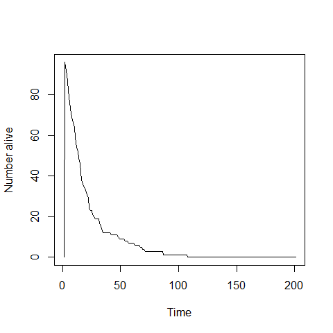


<!--chapter:end:Materials/Programming/Programmingchp-P2.Rmd-->

# Dynamic models Practical

## Introduction to deSolve

### A bit of theory

#### Rationale:

We have discussed the solutions of two differential equations using the fact that we were able to solve them analytically:

$$\begin{aligned} \frac{dN}{dt} &= rN \rightarrow N(t) = N_{0}e^{rt}  \\ \frac{dN}{dt} &= rN\left(1-\frac{N}{K}\right) \rightarrow N(t) = \frac{K}{1+\frac{K-N_{0}}{N_{0}}e^{rt}}\end{aligned}$$

However, most differential equations cannot be solved analytically. For example, with the predation model presented in Dynamic Models Lecture 2, we cannot obtain a mathematical formula giving the number of bacteria (prey) $N(t)$ and amoeba (predators) $P(t)$ as functions of the parameters and initial conditions. Instead we have to resort to numerical methods to obtain approximate values of $N(t)$ and $P(t)$ for any given set of parameter values. Since this is the case for the vast majority of differential equations of interest in science, such numerical methods have been developed for many years and the advent of computers have made them increasingly popular. Throughout this course we will be using a ready-made package in R called
`deSolve` which can solve numerically virtually any system of ordinary differential equations (ODE).

Note: in earlier versions of R, the package was called `odesolve` but worked in the same way.

#### A few notes on Euler's method

Although we will be using `deSolve` as a black box, for your information here is a very basic introduction to how differential equation solvers work. The general principle was devised by Swiss mathematician Leonhard Euler (1707--1783). Among many other things, Euler also came up with the fascinating formula $e-i\pi + 1 = 0$, but that’s another story.

Here I illustrate the method with a single differential equation, but it can easily be extended to any number. Consider the logistic growth model with an arbitrary choice of parameter values: $dN/dt = 0.5N(1 - N/100)$ and initial condition $N(0) = 1$.

The trick is then to ‘discretise’ this equation, i.e. replace the infinitesimal variations of the differential equation by small ‘discrete’ variations. Remember the formal definition of the derivative of a function: $$\frac{dN}{dt} = lim_{\delta t\rightarrow 0}\frac{N(t+\delta t)-N(t)}{\delta t}$$

We then approximate the variations during a small time step $\delta t$ as follows:

$$ \frac{N(t+\delta t)-N(t)}{\delta t} \approx 0.5N(t)\left( 1-\frac{N(t)}{100}\right)$$

So, if we know the value of $N(t)$ at a given time $t$, we can estimate the value at the next time point:

$$ N(t+\delta t) \approx N(t) + 0.5N(t)\left( 1-\frac{N(t)}{100} \right) \delta t$$
If you know the initial density, say $N(0) = 1$, and you choose $\delta t = 0.1$, then you can iteratively calculate approximate values of $N(0.1) \approx 1.0495$, $N(0.2) \approx 1.1014$, etc. which eventually enables you to reconstruct the numerical solution $N(t)$.

The only problem is that $N(0.2)$ is estimated based on an approximate value of $N(0.1)$, and so on. So, as you iterate the process, you accumulate errors and you run the risk of seeing your ‘numerical solution’ drift away from the true solution.

Of course, the smaller $\delta t$, the more accurate the discretisation. See the graph below, where the solid curve is the true solution of the above differential equation (which, in this case, can be solved analytically) and the dots are two ‘discretised solutions’, using $\delta t = 1$ (discs) and $\delta t = 0.5$ (squares):


So, that’s basically what deSolve or any other software does to generate ‘numerical solutions’ of differential equations. They actually use more sophisticated algorithms (but based on the same ‘discretisation’ principle) in order to reduce the potential ‘drift’ from the (unknown) true solution. Different algorithms will perform better on different classes of models, but they are not 100% accurate. One of the most popular class of algorithms for the kind of ODEs used in population dynamics was designed by German mathematicians Runge & Kutta almost 100 years ago.

### The return of the logistic model

#### Load the `deSolve` package

But enough theory for now. Let’s shut the bonnet and sit behind the wheel! We’ll start by re-visiting the logistic growth model to get you acquainted with `deSolve`.

Launch RStudio. The first thing to do is check whether the `deSolve` package is already installed, as it does not come with the R base. In RStudio, click on the “Packages” tab in the bottom-right window to see the list of R packages installed on your computer (those with a checked box are not only installed on the computer but currently loaded in your R session so that you can use them). If `deSolve` is not in the list, click on Install Packages, this opens a window asking you which package you which to install: type `deSolve` and click on Install (you may be asked first to choose a “Mirror”: scroll down the list to UK, and choose London or Bristol). This will download the package from the internet, which means your computer needs to be connected. You only need to do that once on any computer.

**Note**: Instead of using RStudio’s interface, you can type the following instructions in the console: `library()` will open a window with the list of installed packages. If `deSolve` is not there, close the window, return to the R console and type: `install.packages('deSolve')`.

Once a package is installed on a computer, you still need to tell R to load the package into the memory every time you start a new session. In RStudio you can do that by checking the box of the package in the Packages window, but if you need to use the package in a script file, it is safer to type the command `library(deSolve)`.

We’re now ready to start. Open a new script file for this practical code, write some comments (starting with a `#`) that will remind you what’s in this file next time you open it, and type the first instruction:


```r
library(deSolve)
```

**REMEMBER TO SAVE YOUR FILE REGULARLY**

#### Define the model

First, we must define a function `logistic_dyn()` that returns the value of the derivative $dN/dt$, in this case $rN(1 - N/K)$, given the values of $r$, $K$ and $N$. This function will be used by the differential equation solver to generate the numerical solution $N(t)$, so we have to follow specific rules set by the authors of the `deSolve` package:

- The function that defined the derivative must take three arguments: time, a vector containing the values of the variables (in this case a single variable $N$) and a vector of parameter values (in this case two parameters $r$ and $K$).
- The function must return a list containing the value(s) of the derivative(s).

Note that the name of the function, `logistic_dyn`, is arbitrary; you may call it anything you like. Type the following code in your script file:


```r
#This function calculates dN/dt for the logistic model

logistic_dyn <- function(t, N, par){
    #rename the parameters
    r <- par[1]
    K <- par[2]
    #calculate the derivative
    dN <- r*N*(1-N/K)
    #last instruction: return a list
    return(list(dN))
}
```

Note that before calculating the derivative, I defined a few local variables $r$, $K$ and $dN$ (which only ‘exist’ inside the function, so they do not appear in the Workspace) for convenience. A shorter version of the function, without local variables, would be:


```r
logistic_dyn <- function(t, N, par) {
    list(par[1]*N*(1-N/par[2]))
}
```

but you’ll probably agree that it is less easy to read for a human being. The only case when you should favour the latter version is when speed (or memory) is an issue.

Next, create three variables:

- a vector of parameter values (2 values in the order specified in `logistic_dyn`: $r$ first and $K$ second):


```r
logistic_par <- c(1, 100)
```

- a vector of time steps at which we want values of $N$ (note that `deSolve` automatically computes many intermediate time steps as explained in the preamble):


```r
logistic_t <- seq(0, 20, 0.1)
```

- the initial state of the system (in this case just the value of $N_{0}):


```r
logistic_init <- 1
```

We can then feed all that into a function called `lsoda()`, which is the only function from the `deSolve` package that we’re going to use, and store the result into a variable:


```r
logistic_sol <- lsoda(logistic_init, logistic_t, logistic_dyn, logistic_par)
```

Save your file and run all your code so far (click on Source in the top right corner of the script window). In the Workspace window, you should now see the variables you’ve defined under Values, or your new function `logistic_dyn`, under Functions. To visualise the contents of the function, click on its name in the Workspace window, or type `fix(logistic_dyn)` in the Console: this opens a separate window that you must remember to close before you can re-gain access to the command line. You can also look at the contents of the matrix `logistic_sol` in the same way: the first column is your `logistic_t` vector (i.e. the time steps) and the second column contains the corresponding values of $N(t)$.

#### Version with names parameters

A feature of R that can make your life a bit easier when using `lsoda()` is the ability to name the elements of a vector. When we defined `logistic_par` earlier, we had to remember that the first element must be $r$ and the second one $K$. Not too bad with only two parameters, but it can be more of an issue with higher numbers of variables and parameters, as we’ll see next in the next part.

Here is an alternative version of the function `logistic_dyn` which assumes that the third argument, `param`, is a vector whose elements are named $r$ and $K$:


```r
# Calculate the derivative dN/dt using a named vector as its third argument
named_logistic_dyn <- function(t,N,par) {
    # Tell R to use the names of the elements of par (r and K)
    with(as.list(par),{
        return(list(r*N*(1-N/K)))
    })
}
```

The syntax is a bit complicated because we have to tell R that $r$ and $K$ (which are undefined symbols) will actually be defined within `par`. That’s the role of the `with(x,{...})` statement. A further complication is that `with(x,{...})` only works with a named list as its first argument, not a named vector, which is why we wrote `with(as.list(par),{...})`. As a result, every instruction that comes inside `{` `}` in the second argument of `with(x,{...})` can make use of the names of the elements of par.

Once the function `named_logistic_dyn` has been defined, it can only be used with a named vector as a third argument. So, in our case, we must define a new vector:


```r
named_logistic_par <- c(r=1, K=100)
```

Then you can use `lsoda` as follows:


```r
named_logistic_sol <- lsoda(logistic_init,
                            logistic_t,
                            named_logistic_dyn,
                            named_logistic_par)
```

This will give you exactly the same result as `logistic_sol` above. So, with this method, you don’t need to remember the order of the parameters in the function that calculated the derivative, but you need to remember their names.

#### Plot the dynamics

The next step is to plot the dynamics of $N(t)$ using the contents of `logistic_sol`:


```r
plot(logistic_sol[,1], logistic_sol[,2], type='l', main='Logistic growth', xlab='t', ylab='N')

# Just to check, you can superimpose the graph of the analytical solution of the logistic growth model

points(logistic_t,1/(0.01+0.99*exp(-logistic_t)),col='red')
```

<div class="panel panel-default"><div class="panel-heading"> Task </div><div class="panel-body"> 

Now plot a few more graphs with different parameter values (re-define `logistic_par`) or different initial values (`logistic_int`).
 </div></div>


<infobutton id="displayTextunnamed-chunk-84" onclick="javascript:toggle('unnamed-chunk-84');">Show: Plot</infobutton>

<div id="toggleTextunnamed-chunk-84" style="display: none"><div class="panel panel-default"><div class="panel-body">

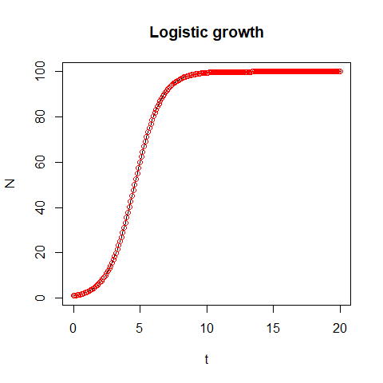
</div></div></div>


### The revenge of the amoeba

#### Code the model

We’ll follow the template described in the previous section, starting with the core function that calculates $dN/dt$ and $dP/dt$. The only difference is that we now have 2 variables, so the function must return a list of two derivatives. There are 5 parameters, so you must be extra careful with the order in which you store them in the vector. To be safe, we’ll enter them in alphabetical order:


```r
# Definition of the predation model
predation_dyn <- function(t,var,par) {
    a <- par[1]
    b <- par[2]
    d <- par[3]
    K <- par[4]
    r <- par[5]
    N <- var[1]
    P <- var[2]
    # Derivatives
    dN <- r*N*(1-N/K)-a*N*P
    dP <- -d*P+b*N*P
    return(list(c(dN,dP)))
}

# Parameter values, initial variables values and the vector of time values:
predation_par <- c(a=0.02, b=0.01, d=0.3, K=100, r=1)
predation_init <- c(N=100, P=1)
predation_t <- seq(0,40,0.2)

# Numerical solution
predation_sol <- lsoda(predation_init,
                       predation_t,
                       predation_dyn,
                       predation_par)
```

The resulting matrix has 3 columns: `predation_sol[,1]` contains the time points, `predation_sol[,2]` the values of $N$ and `predation_sol[,3]` the values of $P$.

Once again, we only defined the local variables $a$, $b$, $d$, etc. to make it easier to read the code and spot any mistake. But we could write a more concise version using only `par[1]`, `par[2]`, etc. instead. Alternatively, you could use `with(as.list(c(par,var)),{ ... })` as we saw in question 2-c above.

#### Plot some graphs

Since we have two variables in this model, we can generate more diverse graphs. You should now be getting familiar with plotting instructions, so I’ll let you work out how to produce the following graphs.

<div class="panel panel-default"><div class="panel-heading"> Task </div><div class="panel-body"> 

- Plot $N(t)$ and $P(t)$ against time, together on a graph, using `plot()`, `lines()` and `legend()`.

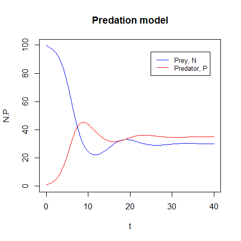
 </div></div>

<button id="displayTextunnamed-chunk-87" onclick="javascript:toggle('unnamed-chunk-87');">Show: Solution</button>

<div id="toggleTextunnamed-chunk-87" style="display: none"><div class="panel panel-default"><div class="panel-heading panel-heading1"> Solution </div><div class="panel-body">

```r
# plot the first line using `plot()`
plot(predation_sol[,1], predation_sol[,2], type = "l", main='Predation model', xlab='t', ylab='N.P', ylim = c(0, 100), col = "blue")

# plot the second line using `lines()`
lines(predation_sol[,1], predation_sol[,3], col = "red")

# add legend using `legend()`
legend(25, 95, legend=c("Prey, N", "Predator, P"),col=c("blue", "red"), lty=1, cex=0.8)
```
</div></div></div>


<div class="panel panel-default"><div class="panel-heading"> Task </div><div class="panel-body"> 

- Plot $N$ and $P$ in the phase plane. Use the notes from lecture 2 to find the equations of the nullclines, and draw them using `abline()`. Finnaly add the equilibrium points.


 </div></div>


<button id="displayTextunnamed-chunk-89" onclick="javascript:toggle('unnamed-chunk-89');">Show: Solution</button>

<div id="toggleTextunnamed-chunk-89" style="display: none"><div class="panel panel-default"><div class="panel-heading panel-heading1"> Solution </div><div class="panel-body">

```r
plot(predation_sol[,2], predation_sol[,3], type = "l", main='Predation model', xlab='N', ylab='P', xlim = c(0, 100), ylim = c(0, 45), col = "black")

# N = 0
abline(v = 0, col = "blue")

# P = 0
abline(h = 0, col = "red")

# P = (r/a) - (rN/Ka)
intercept = predation_par["r"]/predation_par["a"]
slope = -predation_par["r"]/(predation_par["K"]*predation_par["a"])

abline(intercept, slope, col = "blue")

# equilibrium points
points(0, 0, pch = 16, cex = 2)
points(predation_par["K"], 0, pch = 16, cex = 2)
points(
    x = predation_par["d"]/predation_par["b"],
    y = (predation_par["r"]/predation_par["a"])-((predation_par["r"]*predation_par["d"])/(predation_par["a"]*predation_par["b"]*predation_par["K"])),
    pch = 16,
    cex = 2
)
```
</div></div></div>


#### Discussion and further investigations

<div class="panel panel-default"><div class="panel-heading"> Task </div><div class="panel-body"> 

The model has three equilibrium points, determined by the values of the parameters. In the example above, the dynamics converged to the equilibrium point where the prey and predator coexist. 

1. Do you think it would be possible to reach another equilibrium point from different initial conditions?
    
2. What do the dynamics look like if we start from $N(0) = 1$ and $P(0) = 100$?
 </div></div>


<button id="displayTextunnamed-chunk-91" onclick="javascript:toggle('unnamed-chunk-91');">Show: Solution</button>

<div id="toggleTextunnamed-chunk-91" style="display: none"><div class="panel panel-default"><div class="panel-heading panel-heading1"> Solution </div><div class="panel-body">

1. Only if you started at another equilibrium point, otherwise this equilibrium is globally stable and will attract all trajectories.

2. 

```r
predation_init <- c(N=1, P=100)

# Numerical solution
predation_sol <- lsoda(predation_init,
                       predation_t,
                       predation_dyn,
                       predation_par)

# plot the first line using `plot()`
plot(predation_sol[,1], predation_sol[,2], type = "l", main='Predation model', xlab='t', ylab='N.P', ylim = c(0, 100), col = "blue")

# plot the second line using `lines()`
lines(predation_sol[,1], predation_sol[,3], col = "red")

# add legend using `legend()`
legend(25, 95, legend=c("Prey, N", "Predator, P"),col=c("blue", "red"), lty=1, cex=0.8)
```

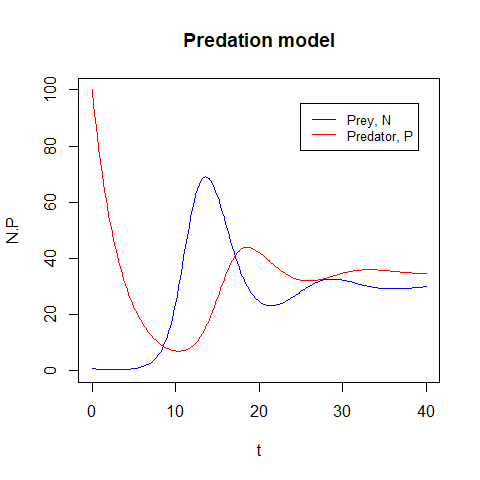
</div></div></div>

Is that what you expected from a biological point of view? *Hopefully! No food for the predators but because this is deterministic, the populations still reach the equilibrium.* What limitations of the model does this suggest? *No stochastic die out.*


<div class="panel panel-default"><div class="panel-heading"> Task </div><div class="panel-body"> 

Observe the effects of changing values of $b$ and $d$ on the equilibrium points and the dynamics. What happens if $d > bK$?
     </div></div>

<button id="displayTextunnamed-chunk-93" onclick="javascript:toggle('unnamed-chunk-93');">Show: Solution</button>

<div id="toggleTextunnamed-chunk-93" style="display: none"><div class="panel panel-default"><div class="panel-heading panel-heading1"> Solution </div><div class="panel-body">

In the below figure, $b = 0.02$ and $d = 0.01$. We can see that the prey population essentially dies out. This changes the stability of the equilibrium points so that the stable equilibrium is the one with both populations nead $0$.

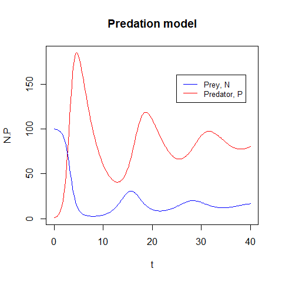
</div></div></div>

<div class="panel panel-default"><div class="panel-heading"> Task </div><div class="panel-body"> 

Change the values of $b$ and $d$ simultaneously so that the ratio $b/d$ remains contant. What do you notice?
     </div></div>

<button id="displayTextunnamed-chunk-95" onclick="javascript:toggle('unnamed-chunk-95');">Show: Solution</button>

<div id="toggleTextunnamed-chunk-95" style="display: none"><div class="panel panel-default"><div class="panel-heading panel-heading1"> Solution </div><div class="panel-body">

```r
par(mfrow = c(2,2))

b_vec = c(0.01, 0.05, 0.1, 0.2)
d_vec = b_vec/(0.01/0.3)

for(i in 1:4) {
    predation_par <- c(a=0.02, b=b_vec[i], d=d_vec[i], K=100, r=1)
    predation_init <- c(N=100, P=1)
    predation_t <- seq(0,40,0.2)
    
    # Numerical solution
    predation_sol <- lsoda(predation_init,
                           predation_t,
                           predation_dyn,
                           predation_par)
    
    plot(predation_sol[,1], predation_sol[,2], type = "l", col = "blue", main = paste("Predation model", "b=", b_vec[i], ",d=", d_vec[i]), xlab = "t", ylab = "N.P", ylim = c(0, 200))
    
    lines(predation_sol[,1], predation_sol[,3], col = "red")
         
}
```

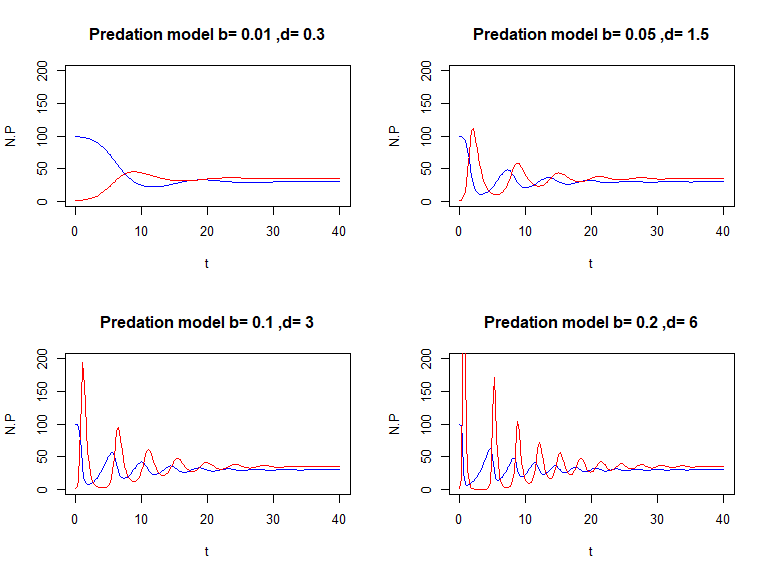

Similar equilibrium but it takes different times to reach it.
</div></div></div>


<!--chapter:end:Materials/Dynamic_Models/Dynamic_models.Rmd-->

# Epidemic models - P1

## The basic SIR model

<div class="panel panel-default"><div class="panel-heading"> Task </div><div class="panel-body"> 

Write down the equations of a frequency-dependent SIR model with no births or deaths and transmission rate $\beta$ and recovery rate $\gamma$.
     </div></div>

<button id="displayTextunnamed-chunk-97" onclick="javascript:toggle('unnamed-chunk-97');">Show: Solution</button>

<div id="toggleTextunnamed-chunk-97" style="display: none"><div class="panel panel-default"><div class="panel-heading panel-heading1"> Solution </div><div class="panel-body">

$$\begin{aligned} \frac{dS}{dt} &= \frac{-\beta SI}{N} \\ \frac{dI}{dt} &= \frac{\beta SI}{N} - \gamma I \\ \frac{dR}{dt} &= \gamma I\end{aligned}$$
</div></div></div>

<div class="panel panel-default"><div class="panel-heading"> Task </div><div class="panel-body"> 

Show that for this model the population size remains constant, i.e. that $dN/dt=0$.
 </div></div>

<button id="displayTextunnamed-chunk-99" onclick="javascript:toggle('unnamed-chunk-99');">Show: Solution</button>

<div id="toggleTextunnamed-chunk-99" style="display: none"><div class="panel panel-default"><div class="panel-heading panel-heading1"> Solution </div><div class="panel-body">

$$\begin{aligned} \frac{dN}{dt} &= \frac{dS}{dt} + \frac{dI}{dt} + \frac{dR}{dt} \\ &= \frac{-\beta SI}{N} + \frac{\beta SI}{N} - \gamma I + \gamma I \\ &= 0 \end{aligned}$$
</div></div></div>

## Coding the model

We’ll follow the template for deSolve that we used in the previous practical, starting with the core function that calculates $dS/dt$, $dI/dt$ and $dR/dt$. Open R, create a new text files and type in:


```r
# SIR Epidemic model - Practical 1
library(deSolve)

SIR_dyn <- function(t,var,par) {
    # Rename the variables and parameters
    S <- var[1]
    I <- var[2]
    R <- var[3]
    N <- S+I+R
    beta <- par[1]
    gamma <- par[2]
    
    # Derivatives
    dS <- -beta*S*I/N
    dI <- beta*S*I/N-gamma*I
    dR <- gamma*I
    
    # Return the 3 values
    list(c(dS,dI,dR))
}
```

**REMEMBER TO SAVE YOUR FILE REGULARLY**

Note that in this model, the total number of individuals $S + I + R$ remains constant, so we would actually only need to define 2 variables (say $S$ and $I$) and calculate 2 derivatives. I’ve included the 3 variables for clarity only. Then define parameter values, initial variables values and the vector of time values:


```r
beta <- 1
gamma <- 0.25
SIR_par <- c(beta,gamma)
SIR_init <- c(99,1,0)
SIR_t <- seq(0,30,by=0.1)

# The numerical solution is given by
SIR_sol <- lsoda(SIR_init,
                 SIR_t,
                 SIR_dyn,
                 SIR_par)
```

If you like, you can relabel your variables so that they are easier to use:


```r
TIME <- SIR_sol[,1]
S <- SIR_sol[,2]
I <- SIR_sol[,3]
R <- SIR_sol[,4]
N <- S + I + R
```

<div class="panel panel-default"><div class="panel-heading panel-heading2"> Note: </div><div class="panel-body"> 

You cannot label time as `time` in lower case letters because it is an inbuilt function in R.
 </div></div>

<div class="panel panel-default"><div class="panel-heading"> Task </div><div class="panel-body"> 

Plot $S(t)$, $I(t)$ and $R(t)$ together on a graph, using the commands `plot()`, `lines()` and `legend()`.


 </div></div>

<button id="displayTextunnamed-chunk-105" onclick="javascript:toggle('unnamed-chunk-105');">Show: Solution</button>

<div id="toggleTextunnamed-chunk-105" style="display: none"><div class="panel panel-default"><div class="panel-heading panel-heading1"> Solution </div><div class="panel-body">

```r
plot(TIME, S, col = "blue", type = "l", ylab = "S, I, R", xlab = "Time")
lines(TIME, I, col = "red")
lines(TIME, R, col = "darkgreen")

legend("topright", legend = c("Susceptible", "Infected", "Recovered"),
       col = c("red", "blue", "darkgreen"),
       pch = c("-","-", "-") )
```
</div></div></div>

You don't have to always plot things against time, it can also be useful to plot variables against each other. Try plotting $S$ against $I$:


```r
plot(S/N, I/N, type = "l", lwd = 3, col = "darkgreen")
```


It can be difficult to read this graph at first. Find where $\text{TIME} = 1$ (at the start $S/N \approx 1$ and $I \approx 0$) and label it on the graph.


```r
index <- which(TIME == 1)

text(S[index]/N[index],I[index]/N[index],"t=1",pos=2)
```


<div class="panel panel-default"><div class="panel-heading"> Task </div><div class="panel-body"> 

Also label $t=2$, $t=5$, $t=10$ and $t=15$. What is happening to time in this plot?
 </div></div>

<button id="displayTextunnamed-chunk-110" onclick="javascript:toggle('unnamed-chunk-110');">Show: Solution</button>

<div id="toggleTextunnamed-chunk-110" style="display: none"><div class="panel panel-default"><div class="panel-heading panel-heading1"> Solution </div><div class="panel-body">

Approaching the steady state.
</div></div></div>

## Some properties of the model

An important question is when does the epidemic reach its peak? A common misconception based on graphs similar to the one above is “$I(t)$ reaches its maximum when $S(t) = R(t)$”.

By now you know that “$I(t)$ reaches its maximum when $dI/dt=0$”.

- Given that $dI/dt=\beta SI/N-\gamma I$, when $I$ is maximum we get $S/N=\gamma /\beta$.
- Check this relationship using the graph of $S/N$ plotted against $I/N$. You might want to use `which.max()` which gives the position of the largest element in a vector.

*Tip*: you can use `abline` to mark on the plot where $I/N$ reaches its maximum.


```r
abline(v=S[which.max(I)]/N[which.max(I)], col ="black")
```

Next, let's look at the effects of $\beta$ and $\gamma$ on the dynamics of the system. In practice, $\beta$ is usually not known before an epidemic, so its estimated in the early stages of an epidemic using the average infectious period $(1/\gamma)$ and $R_{0}$. Instead of calculating and plotting a series of dynamics manually, we'll use a loop to plot 6 graphs in a single window.

<div class="panel panel-default"><div class="panel-heading"> Task </div><div class="panel-body"> 

| Disease | $R_{0}$ | Infectious period, $1/\gamma$ (days) | $\beta$ | Peak size | Peak time | Epidemic size |
|---|---|---|---|---|---|---|
| Flu (H1N1p) | 1.2 | 1 |  |  |  |  |
| Flu | 1.5 | 1 |  |  |  |  |
| SARS | 2.0 | 28 |  |  |  |  |
| Smallpox | 5.0 | 5 |  |  |  |  |
| Measles | 17.0 | 7 |  |  |  |  |
| Pertussis | 17.0 | 14 |  |  |  |  |

Fill in the blanks and excute the following instructions:

```r
# set up a 2 by 3 grid for the plots:
par(mfrow=c(2,3), xaxs='i', yaxs='i')
# define the parameters:
infperiod <- c(1,1,28,5,7,14)
Rzero <- c(1.2,1.5,2,5,17,17)
for (i in 1:6) {
    gamma = signif(1/infperiod[i],2)
    beta = signif(Rzero[i]*gamma,2)
    SIR_par <- c(beta,gamma)
    SIR_sol<-lsoda(SIR_init,
                   SIR_t,
                   SIR_dyn,
                   SIR_par)
    plot(....., ylim=c(0,1),type="l", main=paste0(“beta = “,beta,”gamma = “,gamma))
    lines(.....) # I(t)
    lines(.....) # R(t)
}
```
 </div></div>

<button id="displayTextunnamed-chunk-113" onclick="javascript:toggle('unnamed-chunk-113');">Show: Solution</button>

<div id="toggleTextunnamed-chunk-113" style="display: none"><div class="panel panel-default"><div class="panel-heading panel-heading1"> Solution </div><div class="panel-body">

```r
# set up a 2 by 3 grid for the plots:
par(mfrow=c(2,3), xaxs='i', yaxs='i')
# define the parameters:
infperiod <- c(1,1,28,5,7,14)
Rzero <- c(1.2,1.5,2,5,17,17)
SIR.t =seq(0,500, by=0.1)
for (i in 1:6) {
    gamma = signif(1/infperiod[i],2)
    beta = signif(Rzero[i]*gamma,2)
    SIR_par <- c(beta,gamma)
    SIR.sol <- lsoda(SIR_init,SIR_t,SIR_dyn,SIR_par)
    TIME <- SIR.sol[,1]
    S <- SIR.sol[,2]
    I <- SIR.sol[,3]
    R <- SIR.sol[,4]
    N <- S + I + R
    plot(TIME,S/N,col='blue', type='l', ylim=c(0,1), main=paste("beta = ",beta,"gamma = ",gamma))
    lines(TIME,I/N,col="red")
    lines(TIME,R/N,col="green")
    legend("right", col = c("blue","red","green"),legend = c("S","I","R"), lty = 2)
    print(paste("peak size = ",max(I/N)))
    print(paste("peak time = ",TIME[which.max(I/N)]) )
    print(paste("Epidemic size = ",max(R/N)))
}
```

```
## [1] "peak size =  0.0231066389917149"
## [1] "peak time =  8.1"
## [1] "Epidemic size =  0.344611420022074"
```

```
## [1] "peak size =  0.0697227613470483"
## [1] "peak time =  6.5"
## [1] "Epidemic size =  0.593574217769393"
```

```
## [1] "peak size =  0.0278724769684512"
## [1] "peak time =  30"
## [1] "Epidemic size =  0.0189539739504256"
```

```
## [1] "peak size =  0.480101096709578"
## [1] "peak time =  7.7"
## [1] "Epidemic size =  0.982652741440976"
```

```
## [1] "peak size =  0.776354567432811"
## [1] "peak time =  3.3"
## [1] "Epidemic size =  0.979907643827461"
```


```
## [1] "peak size =  0.774111948146292"
## [1] "peak time =  6.7"
## [1] "Epidemic size =  0.840041300875431"
```
</div></div></div>

For each combination of parameter values, write down $\beta$ and read off the approximate values of the height and time of the epidemic peak and the final epidemic size (the total number of individuals that were infected). (Hint: you may have to extend the time period!)

You can also use the functions `max()` and `which.max()`.

Remember from the lecture that $R_{0}=\beta / \gamma$, therefore $\beta = \gamma R_{0}$.

<div class="panel panel-default"><div class="panel-heading"> Task </div><div class="panel-body"> 

Which of the last 3 quantities appear linked to $R_{0}$?
 </div></div>

<button id="displayTextunnamed-chunk-115" onclick="javascript:toggle('unnamed-chunk-115');">Show: Solution</button>

<div id="toggleTextunnamed-chunk-115" style="display: none"><div class="panel panel-default"><div class="panel-heading panel-heading1"> Solution </div><div class="panel-body">

Peak size and epidemic size.
</div></div></div>


<div class="panel panel-default"><div class="panel-heading panel-heading2"> Note: </div><div class="panel-body"> 

It can be shown mathematically that the epidemic size and the height of the epidemic peak are functions of $R_{0}$ only, although this requires some clever manipulation of the ODES (see Appendix at the end of this handout if you’re interested).

The time to the epidemic peak cannot be directly expressed from the equations, but it is linked to the initial rate of spread of the epidemic. The variations in the number of infected individuals are given by:
    
$$dI/dt = I(\beta S/N-\gamma)$$

At the very beginning of the outbreak, $I(t) << S(t) \approx N$. So we can approximate the ODE above as $dI/dt = (\beta - \gamma )I$, which can be solved as:
    
$$ I(t) = I_{0} exp(\beta - \gamma)t$$
    
So the number of infected individuals initially follows an exponential growth with rate

$$ \beta N - \gamma = \gamma (R_{0} - 1) $$
 </div></div>

<div class="panel panel-default"><div class="panel-heading"> Task </div><div class="panel-body"> 

Plot $log(I(t))$ for $t$ in $[0,4]$ for the same parameter combinations above and check that the initial gradient is equal to $\beta - \gamma$.

*TIP*: you can use `abline` again, this time to impose a straight line $(y=bx + c)$.
 </div></div>

<button id="displayTextunnamed-chunk-118" onclick="javascript:toggle('unnamed-chunk-118');">Show: Solution</button>

<div id="toggleTextunnamed-chunk-118" style="display: none"><div class="panel panel-default"><div class="panel-heading panel-heading1"> Solution </div><div class="panel-body">

```r
#checking initial gradient
par(mfrow=c(2,3))
# define the parameters:
infperiod <- c(1,1,28,5,7,14)
Rzero <- c(1.2,1.5,2,5,17,17)
SIR.t =seq(0,500, by=0.1)
for (i in 1:6) {
    gamma = signif(1/infperiod[i],2)
    beta = signif(Rzero[i]*gamma,2)
    SIR_par <- c(beta,gamma)
    SIR.sol <- lsoda(SIR_init,SIR_t,SIR_dyn,SIR_par)
    TIME <- SIR.sol[,1]
    S <- SIR.sol[,2]
    I <- SIR.sol[,3]
    R <- SIR.sol[,4]
    N <- S + I + R
    plot(TIME[1:41],log( I[1:41]/N[1:41] ),col='red', type='l', main=paste("beta = ",beta,"gamma = ",gamma))
    abline(a = log( I[1]/N[1] ), b = beta-gamma, col = "black")
}
```


</div></div></div>

<div class="panel panel-default"><div class="panel-heading"> Task </div><div class="panel-body"> 

What dynamics do you expect with $R_{0} = 1$? Plot the graph for $\beta = 1$, $\gamma = 1$. Why does $I(t)$ decreases?
     </div></div>

<button id="displayTextunnamed-chunk-120" onclick="javascript:toggle('unnamed-chunk-120');">Show: Solution</button>

<div id="toggleTextunnamed-chunk-120" style="display: none"><div class="panel panel-default"><div class="panel-heading panel-heading1"> Solution </div><div class="panel-body">

As our initial conditions are with $99$ susceptible people, and $R_{0}=1$ this renders the **effective reproduction number** less than $1$ so $I(t) decreases.
</div></div></div>

<div class="panel panel-default"><div class="panel-heading"> Task </div><div class="panel-body"> 

Explore the behaviour of the system around $R_{0} \approx 1$ using the loop you wrote before. Try changing $0.9 < R_{0} < 1.1$ and altering the initial number of individuals infected.
 </div></div>

<button id="displayTextunnamed-chunk-122" onclick="javascript:toggle('unnamed-chunk-122');">Show: Solution</button>

<div id="toggleTextunnamed-chunk-122" style="display: none"><div class="panel panel-default"><div class="panel-heading panel-heading1"> Solution </div><div class="panel-body">

```r
### looking around R0 = 1
par(mfrow=c(2,3))
# define the parameters:
SIR.init <- c(99,1,0)
infperiod <- rep(2,6)
Rzero <- c(0.9,0.95,1,1.05,1.1, 1.15)
SIR.t =seq(0,100, by=0.1)
for (i in 1:6) {
    gamma<- signif(1/infperiod[i],2)
    beta <- signif(Rzero[i]*gamma,2)
    SIR_par <- c(beta,gamma)
    SIR.sol <- lsoda(SIR_init,SIR_t,SIR_dyn,SIR_par)
    TIME <- SIR.sol[,1]
    S <- SIR.sol[,2]
    I <- SIR.sol[,3]
    R <- SIR.sol[,4]
    N <- S + I + R
    plot(TIME, I/N,col='red', type='l', ylim=c(0,0.03),
main=paste("R0 = ",Rzero[i]))
}
```


</div></div></div>

## Calculating the infectious period

If the recovery rate of a disease is $\gamma = 0.2$ days$^{-1}$, what is the average infectious period?

- For a given constant recovery rate of $\gamma = 0.2$ days$^{-1}$ plot the proportion of individuals still infected over time.


```r
# set up a vector of times:
x=seq(0,30,0.1)

# define the recovery rate, gamma:
gamma=0.2

# define the exponential function:
fx=exp(-gamma*x)

#plot:
plot(x,fx,type="l")
```

- Calculate the average infectious period using the function defined above.


```r
print(sum(fx*x)/sum(fx))
```

<div class="panel panel-default"><div class="panel-heading"> Task </div><div class="panel-body"> 

How do your two answers compare?
     </div></div>

<button id="displayTextunnamed-chunk-126" onclick="javascript:toggle('unnamed-chunk-126');">Show: Solution</button>

<div id="toggleTextunnamed-chunk-126" style="display: none"><div class="panel panel-default"><div class="panel-heading panel-heading1"> Solution </div><div class="panel-body">

Not quite the same but perhaps will have a better approximation as you use more points.
</div></div></div>


## Optional section - extending SIR to other compartments

As we saw in the lecture, the S-I-R framework is only a crude representation of the real natural history of a disease. Think of another formulation and see how the results compare to a standard SIR model. Some suggestions:

- Include loss of immunity, so that Recovered individuals become Susceptible again after a certain period
of time.
- Include a latent state post-infection but before an individual becomes infectious (this type of model is often called an SEIR model, where E stands for the Exposed class).
- Include treatment in the model, allowing Infected individuals to recover more quickly.


- Sketch a diagram of your model, showing the compartments and the flows between them.


- Write down the equations that govern your model


- Write a function, such as `SEIR_dyn()` that calculates the derivatives of your model for use with `lsoda()`.
- Plot the epidemic curve, $I(t)$. How does this compare to an equivalent SIR model?

<button id="displayTextunnamed-chunk-127" onclick="javascript:toggle('unnamed-chunk-127');">Show: Solution</button>

<div id="toggleTextunnamed-chunk-127" style="display: none"><div class="panel panel-default"><div class="panel-heading panel-heading1"> Solution </div><div class="panel-body">

```r
#### Extra exercise
# I am putting everything in at once

SEITRS.dyn <- function(t, var, par) {
    # Rename the variables and parameters
    S <- var[1]
    E <- var[2]
    I <- var[3]
    tr <- var[4]
    R <- var[5]
    N <- S + E + I + tr + R
    beta <- par[1]
    gamma <-par[2]
    epsilon <- par[3] #rate of latency loss
    tau <- par[4] #treatment rate
    omega <- par[5] #recovery rate for treated people
    
    # Derivatives
    dS <- -beta*S*I/N
    dE <- beta*S*I/N - epsilon*E
    dI <- epsilon*E - gamma*I - tau*I
    dT <- tau*I - omega*tr
    dR <- gamma*I + omega*tr
    # Return the 5 values
    list(c(dS, dE, dI, dT, dR))
}

beta <- 2
gamma <- 0.25
epsilon <- 1
tau <- 1
omega <- gamma*2

SEITRS.par <- c(beta,gamma,epsilon,tau,omega)
SEITRS.init <- c(99,1,0,0,0)
SEITRS.t <- seq(0,30,by=0.1)

SEITRS.sol <- lsoda(SEITRS.init,SEITRS.t,SEITRS.dyn,SEITRS.par)

TIME <- SEITRS.sol[,1]
S <- SEITRS.sol[,2]
E <- SEITRS.sol[,3]
I <- SEITRS.sol[,4]
tr <- SEITRS.sol[,5]
R <- SEITRS.sol[,6]

N <- S + E + I + tr + R

plot(TIME,S/N,col='blue', type='l', ylim=c(0,1))
lines(TIME,E/N,col="orange")
lines(TIME,I/N,col="red")
lines(TIME,tr/N,col="cyan")
lines(TIME,R/N,col="green")
legend("right", col = c("blue","orange", "red","cyan","green"), legend = c("S","E","I","T","R"), lty = 2)
```


Plenty to note on the different dynamics as you experiment with the above- one thing to examine is that we now have multiple infected states and this can make calculating $R_{0}$ more complicated as we need to use the next generation matrix approach, shown later in the course.
</div></div></div>


## Appendeix - Epidemic peak and final epidemic size

Although it is not possible to solve the differential equations of the SIR system analytically to obtain expressions for $S(t)$, $I(t)$ and $R(t)$, we can obtain an implicit solution in the $(S,I)$ phase plane. In other words, we can obtain a mathematical relationship between the values of $S$ and $I$ at any time point. The trick is to re-write the system

$$\begin{aligned} \frac{dS}{dt} &= -\beta SI/N \\ \frac{dI}{dt} &= \beta SI/N - \gamma I \end{aligned}$$

as a single differential equation for $I$ as a function of $S$. Under certain mathematical conditions that we won’t discuss here, the variations of $I$ with respect to $S$ can conveniently be written as:

$$\frac{dI}{dS} = \frac{dI/dt}{dS/dt} = \frac{\beta SI/N - \gamma I}{-\beta SI/N} = \frac{\gamma N}{\beta S} - 1$$

Using the integration rules from the maths lectures, we can actually solve this ODE:

So, given the initial conditions, we can deduce the value of $I(t)$ from the value of $S(t)$ at any time point. How is that helpful? First consider the question of the height of the epidemic peak. We know that $I(t)$ reaches its maximum when $S(t) = \gamma/\beta$. Hence the height of the epidemic peak:

$$I_{max} = I_{0} + \frac{\gamma}{\beta} log \frac{\gamma}{\beta S_{0}} + S_{0} - \frac{\gamma}{\beta}$$

Assuming that $I(0) << S(0) \approx N$, then we can write $R_{0}\approx\beta S(0)/\gamma$, hence:

$$I_{max}/N \approx 1-(1+logR_{0})/R_{0}$$

You can check it on the graphs from section 2 above. Next, the final epidemic size is given by the final valuep of $S(0) - S(t)$, i.e. taking $t \rightarrow \infty$. Under the same assumptions as above, and letting $x = S(0) - S(\infty)$ be the proportion of the $N$ population that gets infected over the whole epidemic, we get the following equation: $x + log(1 - x)$, which can only be solved numerically.

R does not have a built-in numerical solver for nonlinear equation, but it has a function called `optimize()` that searches for the minimum of a numerical function. The trick is to notice that solving an equation of the form $f(x) = 0$ is equivalent to finding the minimum of $f^{2}(x)$, the square of $f(x)$. If you’re not convinced, sketch a graph of an arbitrary function that crosses the x-axis, then sketch the square of that function.

We can therefore estimate the epidemic size for any value of R0 using the following code:


```r
my_fun <- function(x,R0) {
    (x+log(1-x)/R0)ˆ2
}
optimize(my_fun, c(0,1), R0=2)
```

where the three arguments of optimize are: 

- the function to minimize with respect to its first argument (in this case $x$), - the interval over which to search for a solution
- the numerical values of any other argument of `my_fun` (in this case $R_{0}$).


We’ll see more about `optimize()` next week, so I wont give any more detail here.


<!--chapter:end:Materials/Epidemic_models/Epidemic_models-P1.Rmd-->

# Epidemic models - P2

## Calculating $R_{0}$

We wish to calculate $R_{0}$ which is defined as the expected number of secondary infections per generation given one infected individuals is introduced to an entirely susceptible population.

Mathematically, we examine our system equations for the **infectious compartments only* at **disease free equilibrium** and see how they *change** as each infectious variable changes.

We divide this into two situations:

- Transmission events where a new infectious variable is created eg. a susceptible person be-comes infected

- Transition events where an infectious variable is lost eg. an infected person recovers.

SIR example:

$$ \frac{dS}{dt} = \mu H - \beta SI - \mu S$$
$$ \frac{dI}{dt} = \beta SI - \mu I - \gamma I$$
$$ \frac{dR}{dt} = \gamma I - \mu R$$

We only have one infectious variable: $I$.

So our system of infectious compartments is only the equation for the change in the infected population over time.

$$ \frac{dI}{dt} = \beta SI - \mu I-\gamma I$$

Next we wish to know how this equation varies as the infectious variable, $I$, varies.

To do this we _____________________ with respect to $I$ to get:

<div class="panel panel-default"><div class="panel-heading"> Task </div><div class="panel-body"> 

&nbsp;

&nbsp;

&nbsp;

&nbsp;
 </div></div>


We are interested in our system at disease free equilibrium, so wherever we see a variable, we replace it with its **equilibrium value**.

At disease free equilibrium: $S^{*}=H$, $I^{*}=0$, $R^{*}=0$.

<div class="panel panel-default"><div class="panel-heading"> Task </div><div class="panel-body"> 

&nbsp;

&nbsp;

&nbsp;

&nbsp;
 </div></div>


Now we can divide our equation into **transmission** events and **transition** events.

**Transmission terms:**

<div class="panel panel-default"><div class="panel-heading"> Task </div><div class="panel-body"> 

&nbsp;

&nbsp;

&nbsp;

&nbsp;
 </div></div>


**Transition terms:**

<div class="panel panel-default"><div class="panel-heading"> Task </div><div class="panel-body"> 

&nbsp;

&nbsp;

&nbsp;

&nbsp;
 </div></div>


Finally, $R_{0}$ is calculated by dividing the **Transmission** terms by (- **Transition** terms).

The intuition is that **$1/\text{Transition}$** is equal to the **generation time**.

Thus, we arrive at the **transmission events** per **generation**.


<div class="panel panel-default"><div class="panel-heading"> Task </div><div class="panel-body"> 

$R_{0} =$

&nbsp;

&nbsp;

&nbsp;

&nbsp;
 </div></div>


<!--chapter:end:Materials/Epidemic_models/Epidemic_models-P2.Rmd-->

# Epidemic models - P3

**Stochastic models**

*Aim*: To explore the effects of stochasticity on simple SI and SIR models and contrast their behaviour with previous deterministic results.

*Goals*: 

By the end of this practical participants should be able to achieve the following:

- Code up a simple stochastic SI model in R using the `SimInf` package
- Code up a simple stochastic SIR model in R using the `SimInf` package
- Run both single and multiple realisations and visualise the results
- Explore extensions to both SI and SIR models
    + Expand the SI model to include additional transitions
    + Understand the impact of R0 values on stochastic extinction
    
*Background*: This practical follows on from the Stochastic Epidemic Models Lecture 5 and echoes the content presented there.


## Coding a simple SI model

We will first implement a slight modification to the code that has been presented to you in the previous Stochastic Epidemic Lecture (Epidemics L5). The key difference between the code presented in the lecture and the code shown here is that we are putting the code into a function (called `StocSI.dyn`) rather than just running a series of commands.

- Open Rstudio
- Open a new blank script file
- Save it as `Stock_SI.R`

If you haven't already instealled the package `SimInf`:

- Click packages tab in lower right sub-window
- Click Install
- Type: `SimInf` in the Packages box
- Click Install

If you’re on a Windows computer then you’ll need to do some additional work to use `SimInf` (macOs and Linux users should be fine)

- Download Rtools from [https://cran.r-project.org/bin/windows/Rtools/](https://cran.r-project.org/bin/windows/Rtools/)
    + Click on the appropriate version of RTools on the left
    + For RTools 4.2 (the most up to date version) click on the link `Rtools42_installer`. It’s in the third paragraph down in the second section
    + Once it’s downloaded install it using all of the default settings
    + This might take a couple of minutes, but click Finish when it’s done
- Add the path to Rtools to your PATH environment variable
    + Click on the windows icon in the bottom right of the screen
    + Type environment variable in the search box
    + This should bring up the System Properties window. Click on the Environment Variables button
    + Select on the *Path* row in the second table (entitled System Variables) and click Edit…
    + Click New
    + Type `C:\Rtools\bin`
    + Click OK on all windows
    
Great!

Now we can finally actually get on with the simulations.


**In the script window type the following commands**:


```r
require(SimInf)

create.StocSI <- function(N, I0, beta , f_time) {
    
    initial_state <- data.frame(S = N-I0 , I = I0)
    compartments <- c("S", "I")
    transitions <- c("S -> beta*S*I/(S+I) -> I")
    tspan <- seq(from = 1, to = f_time, by = 1)
    
    model <- mparse(transitions = transitions, compartments = compartments, gdata = c(beta = beta), u0 = initial_state, tspan = tspan)
    
    return(model)
}
```


Make sure you save your file and that your working directory is the same as the folder you have saved this into (Choose from menu Session > Set Working Directory > To Source File Location).

This code creates a function that creates a single stochastic SI model. We’ll dissect/explain the code in the next section.

Open a new blank script file.

Save it as `Epi_P3.R`

We’ll use this script to record all of the steps in this practical (unless otherwise indicated).

In the script window type the following commands and then run (select and press run button in RStudio):


```r
source('Stoch_SI.R')
SImodel <- create.StocSI(500, 1, 0.5, 30)
out <- run(model = SImodel)
plot(out)
```

You should see a graph that looks similar to this:


Here we can see the two trajectories for an SI epidemic. The susceptible curve (red) starts at 499 and stochastically decreases down whilst the infected curve (blue) starts at 1 and mirrors the S curve increasing stochastically.


## Dissecting the stochastic SI code

The function we have just created is a wrapper that takes the basic parameters that define the SI model for a particular population and creates a R object that the `SimInf` package can use to simulate the model. Our function `create.StocSI` takes four inputs:

- Total population size: <span style="color:red">N</span>
- Initial number of infected: <span style="color:red">I0</span>
- Infection rate: <span style="color:red">beta</span>
- Time to simulate for: <span style="color:red">f_time</span>

Inside the function we combine this information to create four R objects that when passed to the `SimInf` function `mparse`. The output from the `mparse` function is returned as the output to our `create.StocSI` function.

Here we will break down what we have just written and explain what is required for the `mparse` function.


<div class="panel panel-default"><div class="panel-heading panel-heading2"> Note: </div><div class="panel-body"> 

The `SimInf` package includes its own function that defines SIR, SEIR and SIS models (of which the SI model is a special case). The `mparse` function can define any generic compartmental model so it is worth learning about…
 </div></div>


The `mparse` function requires that you specify the following information:

- The list of all compartments of the system
- The initial states (or compartments) of the system
- the events (or transitions) of the system
- the values of any parameters
- the time points where the value of each state is to be recorded for each simulation

An SI model is described by the following system of *differential* equations:

$$\frac{dS}{dt} = -\beta\frac{SI}{N}$$
$$\frac{dI}{dt} = \beta\frac{SI}{N}$$

And from these equations we can derive a transition diagram from the system:

$$ S \rightarrow \beta\frac{SI}{N} \rightarrow I$$

- From this diagram we can see that there are two states for this system: susceptible and infected (S & I). We define all of the compartments of the model using a vector:


```r
compartments <- c("S","I")
```

- In order to begin the simulation, we need to specify the initial values of each compartment. We specify these using a data frame with a single row and column for each compartment specified above:


```r
initial_state <- data.frame(S = N-I0, I = I0)
```

where `N` (the total population number) and `I0` (the initial number of infected) have been specified by the user.

- There is one event (or transition): infection.


```r
transitions <- c("S -> beta*S*I/(S+I) -> I")
```

where the effect is to move one susceptible into the infected compartment at a rate $\beta \frac{SI}{N}$ where $N=S+I$ and beta must be specified by the user. The syntax we use here should be self-explanatory (hopefully) but the idea is that we have the following syntax “A $\rightarrow$ rate $\rightarrow$ B” where A is the name of the starting compartment, B is the name of the ending compartment and rate explains how to calculate the rate.

- We must tell algorithm how long we want it to run for before stopping and at what points we wish to record the value of the compartments. We use the user specified variable `f_time` to specify a sequence of daily output values up to a maximum value of `f_time`.


```r
tspan <- seq(from = 1, to = f_time, by = 1)
```

NB: `SimInf` was designed to work with real epidemiological data and as such the minimum output timestep size is 1 (corresponding to 1 day).

- The `mparse` function takes the arguments we’ve just created, processes (*‘parses’*) them into a low-level computer language and compiles the resulting program into machine code. This machine code is considerably (orders of magnitude) faster than the equivalent R code. We assign the output of this function to the object `SImodel` (An object in R is a special data type that combines functions with data).

- Objects can be used as arguments to functions in the same way as normal data types. In this case we can use the `run()` function to run a stochastic simulation of the `SImodel`:


```r
out <- run(model = SImodel, threads = 1)
```

The threads argument is optional here, but this argument would allow us to parallelise our code (if our setup allows it).

- The run function implements (and runs) the stochastic simulation algorithm for any stochastic model defined by the `mparse` function and returns a new object which contains the output of the simulation (which we’ve called out).

- The `SimInf` package provides a special plot function for this output


```r
plot(out)
```

This explains the code you’ve produced so far, but there are limitations. We would like to plot multiple stochastic realisations onto a single plot and investigate their aggregated properties. To do this we will need to modify our code somewhat.

## Performing Multiple Simulations

Let’s update our `create.StocSI` function in the (`Stoch_SI.R` file) to create a model with multiple copies of the same population. This is the simplest possible meta-population model where there is no interaction between patches, and a neat hack to run multiple replicate simulations at the same time.

**Edit `Stoch_SI.R` to update the definition of the `create.StocSI` as follows:**


```r
create.StocSI <- function(N, I0, beta, f_time, reps = 1) {
    
    initial_state <- data.frame(S = rep(N-I0, reps) , I = rep(I0, reps))
    compartments <- c("S", "I")
    transitions <- c("S -> beta*S*I/(S+I) -> I")
    tspan <- seq(from = 1, to = f_time, by = 1)
    
    model <- mparse(transitions = transitions, compartments = compartments, gdata = c(beta = beta), u0 = initial_state, tspan = tspan)
    return(model)
}
```

The only two things we’ve changed here are:

1. We’ve created a new argument call `reps` which we’re using to specify the number of simulations that we want the code to run.

2. We’ve changed how we specify the `initial_state` dataframe. This is now a dataframe that has `reps` number of rows and 2 columns. The first column contains the starting number of susceptible individuals in each of our simulations, and the second column contains the number of initial infected individuals.

Again, remember to **save** your file.


<div class="panel panel-default"><div class="panel-heading panel-heading2"> Note: </div><div class="panel-body"> 

we have added a new argument to `create.StocSI` which has a default value `reps`$=1$. By adding the argument in this way we ensure that any code we wrote earlier assuming only one replicate would still work with no modifications.
 </div></div>

Type in the following code into `Epi_P3.R` and run:


```r
#Multiple replicates
source('Stoch_SI.R')
SImodel <- create.StocSI(500, 1, 0.5, 30, 20)
out <- run(model = SImodel)
plot(out)
```

This should produce a plot that looks similar to the following:


By default the plot command will always:

1. plot the curves for all states on the same graph (so we can see both S and I curves here)

2. use a step function to plot the curves (which is why it’s a bit, um, step-y)

3. show the average and interquartile range as a transparent envelope when multiple simulations have been run.

If we want to actually see individual realisations, we need to use some of the other arguments to the plot function. **Try typing this in:**


```r
plot(out , 'I', range=FALSE , type = 'l')
```

This should produce a plot that look similar to the following:


- The second argument is a character vector specifying which compartments we want to see. Here we’ve asked to only see the curves for the infected I compartment.
- The named argument `range` is used to specify the shaded quantile on the plot. By specifying `FALSE`, we’ve turned it off and forced R to plot the individual trajectories instead. If we’d specified a numeric value between 0 and 1 then we would see the equivalent shaded range plotted instead (i.e. $range=0.5$ corresponds to plotting the interquartile range and $range = 0.95$ corresponds to plotting the wider 95% quantiles)
- We can use the standard `type` argument from the base R plot function to specify the type of curve we want. The default is `type='s'` for steps, but here we’re asking for the smoother `type='l'` lines option.


### Adding the deterministic solution curve

There will be an R script file called `Det_SI.R` on the shared drive (your demonstrator will know where). It contains the code for a deterministic SI model based upon the code you encountered in the first epidemic models practical. It is specifically designed to use the same parameters as have been used in the stochastic SI code written above and will add a deterministic trajectory to your plot.

**Type in the following:**


```r
#Adding a deterministic trajectory
source('Det_SI.r')
det.sol <- DetSI.dyn(500, 1, 0.5, 30)

det.t <- det.sol[,1]
det.I <- det.sol[,3]

lines(det.t, det.I, lwd=3 , col='red')
```


## Exploring the effects of Stochasticity

<div class="panel panel-default"><div class="panel-heading"> Task </div><div class="panel-body"> 

**Exercise 1**

Modify the above code to explore the effects of different initial conditions `($I_{0}$ = 1, 5, 10, 50, 100)` on the stochastic replicates. Keep the total population size constant ($N=500$).

**Qualitatively what effect does this have on the variability between replicates?**
 </div></div>

<div class="panel panel-default"><div class="panel-heading"> Task </div><div class="panel-body"> 

**Exercise 2**

Now vary the population size `(N = 50, 500, 5000)` with $I_{0} = 1$.

**Qualitatively what effect does this have on the variability between replicates?**
 </div></div>

<div class="panel panel-default"><div class="panel-heading"> Task </div><div class="panel-body"> 

**Exercise 3**
    
Now vary the infection rate $(\beta = 0.1, 0.5, 1)$.

**Qualitatively what effect does this have on the variability between replicates?**
 </div></div>

## The delay time

Graphical exploration of model output is a good way to orientate yourself and understand the qualitative impact of changing parameters, but in practice we do need to explore various summary statistics. In this section we will compare the time it takes for a stochastic epidemic to infect half of the total population, $t_{\frac{1}{2}}$, with the time a deterministic epidemic takes. This difference is the delay time, $\delta t$ (see the figure below).


We will repeat this for many stochastic replicates and plot a distribution of the delay times.

### The deterministic half-time

The deterministic model predicts a constant value of $t_{\frac{1}{2}}$ given by the expression:

$$t_{\frac{1}{2}} = -\frac{1}{\beta}ln\frac{I_{0}}{N-I_{0}}$$

(This can be derived exactly from the analytic solution to the system of differential equations for the SI system. This isn’t going to be possible for more complex models).

### The stochastic half-time

We must now construct a function that calculates the value of $t_{\frac{1}{2}}$ for a set of stochastic simulations and the corresponding delay times:

Open a new script file and save as `Half_time.R` with the following content:


```r
# Deterministic Halftime Function
det_halftime <- function(N, I0, beta) {
    
    # calculate deterministic half life
    return((-1/beta)*log(I0/(N-I0)))
}

# Stochastic Halftime Function
stoc_halftime <- function(model) {
    
    no_runs = n_nodes(model)
    N = sum(model@u0[,1])
    
    # create storage vector for stochastic half lives
    thalf <- numeric(no_runs)
    
    # loop over number of replicates
    for (iSim in 1:no_runs) {
        # extract the infected time series for each simulation
        output <- trajectory(out, "I", iSim)
        
        # find the first time when the infected population is at least half the total population
        ind <- min(which(output$I>=(N/2)))
        thalf[iSim] <- output$time[ind]
    }
    
    return(thalf)
}
```

The function `det_halftime` takes three arguments:

- The total host population <span style="color:red">N</span>
- The initial number of infected <span style="color:red">I0</span>
- The infection rate <span style="color:red">beta</span>

and returns the deterministic value of the time to half-height.

The function `stoc_halftime` takes a SimInf model object as its input and returns a vector with the time to half height of each model simulation (to nearest day)

We then plot a probability density plot for these delay times using the in-built function `density`.


```r
source('Half_time.R')
SImodel <- create.StocSI(500, 1, 0.5, 30, 100)
out <- run(model = SImodel)

delay_times <- stoc_halftime(out) - det_halftime(500, 1, 0.5)

plot(density(delay_times), main = '')
```

`density` produces smoothed estimates of the frequency distributions of a set of samples (essentially a smooth line through the top of a histogram). This will produce a figure similar to the one below:


<div class="panel panel-default"><div class="panel-heading"> Task </div><div class="panel-body"> 

**Exercise**
   
Can the distribution of delay-times be used to quantify the appropriateness of the deterministic approximation for a given set of parameters? In particular, in what limits will the deterministic model produce useful predictions for the time-scale of an SI epidemic? You may wish to revisit the impact of changing the host-population size N, initial number of infectives $I_{0}$ and infection rate. Produce plots to justify your reasoning and discuss them with a demonstrator.
 </div></div>


## Coding a simple SIR model

Using the results from the earlier section on SI models as a starting point we will construct a stochastic SIR model. The deterministic SIR model equations are given by

$$\frac{dS}{dt} = -\beta\frac{SI}{N}$$
$$\frac{dI}{dt} = \beta\frac{SI}{N}-\mu I$$
$$\frac{dR}{dt} = \mu I$$

### Exercise one

1. Using these equations construct a transition diagram for the system
2. What are the states/compartments for this system?
3. What are the transitions events and what are the rates associated with each event?
4. What is the initial state of the system (i.e. how many individuals should be in each compartment initially)?

One a new script in RStudio.

Using the functions developed in the previous sections as a template construct a `create.StocSIR` function that takes five arguments:

- N: the total population size
- I0: the initial number of infected individuals
- beta: the infection rate
- mu: the recovery rate
- f_time: the time the simulation will run for (daily steps)
- reps: the number of replicate simulations to run

The skeleton function below can serve as a starting point.


```r
create.StocSIR <- function(N, I0, beta, mu, f_time, reps = 1) {
    initial_state <-
    compartments <-
    transitions <-
    tspan <-
    
    model <- mparse(transitions = transitions,
                    compartments = compartments,
                    gdata = c(beta = beta, mu = mu),
                    u0 = initial_state,
                    tspan = tspan)
    
    return(model)
    
}
```


<div class="panel panel-default"><div class="panel-heading panel-heading2"> Hint </div><div class="panel-body"> 

To specify multiple transitions in the `SimInf` algorithm you will need a transitions vector with two elements to it like this:

```r
tansitions <- c('S -> ?? -> I', 'I -> ?? -> R')
```

where I have deliberately replaced the relevant transition rates with ??. You will need to replace the ?? with the correct rate equations.
 </div></div>

Using your function run the following code:


```r
SIRmodel <- create.StocSIR(500, 1, 1, 0.25, 30)
out <- run(model = SIRmodel)
plot(out)
```

This should produce a graph that looks like this:


However, some of you will see a very different graph. (If you do get something like this plot then try rerunning the model and plotting it several times until you see something different.)

**Why might this be the case?**

&nbsp;

&nbsp;

&nbsp;

&nbsp;


### Exercise two

Use this function to plot 50 replicates of the infection curves (use the code in the previous SI section as a guide.

This should produce a graph that looks like this:


### Exercise three

Load the R script called `Det_SIR.R` and adapting your code from the previous section make a plot that overlays the deterministic solution with the output of the stochastic model.


## SIS Extension: Adding Recovery from Infection

Consider a system where individuals recover from infection with a fixed rate $\alpha$ and return to the susceptible class. This SIS system is described by the following system of equations:

$$\begin{aligned} \frac{dS}{dt} &= \alpha I - \beta\frac{SI}{N} \\ \frac{dI}{dt} &= \beta\frac{SI}{N} - \alpha I \end{aligned}$$

<div class="panel panel-default"><div class="panel-heading"> Task </div><div class="panel-body"> 

1. Draw the transition diagram for this system.

2. For each transition write down the rate at which it occurs.

3. What are the parameters required for this model?
    
4. Write a new function `create.StocSIS` based upon the `create.StocSI` function and add to the `Stoch_SI.R` file and repeat the above analysis.
 </div></div>

## SIS Extension: Adding host demography

Consider an SI model with host demography. The system has constant birth rate $\Lambda$ into the susceptible class and fixed per capita mortality rate $\mu$ from both the susceptible and infectious classes and is governed by the following equations:

$$\frac{dS}{dt} = \Lambda - \beta\frac{SI}{N} - \mu S$$
$$\frac{dI}{dt} = \beta\frac{SI}{N}-\mu I$$

<div class="panel panel-default"><div class="panel-heading"> Task </div><div class="panel-body"> 

Repeat the previous steps for this model and create a `create.StocSI_demo` function in `Stoch_SI.R` and then explore its dynamics.
 </div></div>


<div class="panel panel-default"><div class="panel-heading panel-heading2"> Hint </div><div class="panel-body"> 

- To specify a birth (or death) event then we use the @ symbol to represent the “empty” compartment from which births appear (or to which deaths end up). So a birth event into the susceptible compartment would have the following transition string:

```r
'@ -> ?? -> S'
```

- Use these initial values for the parameters:
    + alpha $= 0.1$
    + beta $=0.5$
    + lambda $=100$
 </div></div>


## SIR Extension: The final epidemic size

In order to further explore the effects of stochasticity in the SIR model we are going to explore the how the final size of an epidemic varies between realisations.

### Exercise one

<div class="panel panel-default"><div class="panel-heading"> Task </div><div class="panel-body"> 

- What is the final size of an epidemic?
- What does it mean?
- Which state variable do we need to consider in order to calculate the final epidemic size?
    
For stochastic simulations the final epidemic size will vary between realisations of the epidemic which will mean that we need to think about a *distribution* of final epidemic sizes.
 </div></div>


### Exercise two

<div class="panel panel-default"><div class="panel-heading"> Task </div><div class="panel-body"> 

Write code to calculate the final epidemic size from a `SimInf` output object.
 </div></div>

<div class="panel panel-default"><div class="panel-heading panel-heading2"> Hint </div><div class="panel-body"> 

- What value should the final time for the simulations be set to (roughly)?
- As we’ve seen before, the function `trajectory` can be used to extract the actual values of the different compartments at each time point.
- Look at the code we used in the previous practical for calculating the halftime values for a single simulation and modify that logic accordingly.
 </div></div>

### Exercise three

<div class="panel panel-default"><div class="panel-heading"> Task </div><div class="panel-body"> 

Run 100 realisations, extract the final epidemic size from each one and then produce a histogram of the final sizes. It should look something similar to the figure below:


 </div></div>


<div class="panel panel-default"><div class="panel-heading panel-heading2"> Hint </div><div class="panel-body"> 

- You’ll probably want to use a loop to extract the final size for each simulation
- Set the histogram to use 500 bins
 </div></div>

**Why does the histogram have a bimodal distribution?**

### Exercise four

Recall that the final epidemic size for the deterministic SIR model showed strong dependency on the value of the basic reproductive number, $R_{0}$.

<div class="panel panel-default"><div class="panel-heading"> Task </div><div class="panel-body"> 

- Write down an expression for $R_{0}$ for this system as a function of the parameters $\beta$ and $\mu$.
- Does this help explain the bimodal result?
     </div></div>

### Exercise five

For this section, we shall vary the value of $R_{0}$ by varying the transmission rate, $\beta$, whilst keeping the recovery rate, $\mu$, at a fixed value.

<div class="panel panel-default"><div class="panel-heading"> Task </div><div class="panel-body"> 

Explore how the final size distribution varies with R0 by producing histograms of the final size distribution as per the above figure for values of $R_{0} = 20.0$, $5.0$, $2.0$, $1.2$, $1.0$, $0.9$, $0.5$.

Can you always identify the two modes of the distribution?
 </div></div>


## SIR Extension: Stochastic extinction

One of the primary differences between the deterministic and stochastic formulations of the SIR model is that in the stochastic formulation the epidemic becomes extinct within a finite time, the so-called extinction time. The extinction time varies between realisations and in this section we are going to explore this distribution.

### Question

Which state variable do we need to consider in order to calculate the time to epidemic extinction and what is the value of this state variable at extinction?

### Exercise one

As with the final epidemic size, the extinction time will vary over realisations of the epidemic which will result in a distribution of extinction times, which we are now going to explore.

<div class="panel panel-default"><div class="panel-heading"> Task </div><div class="panel-body"> 

Adapt your previous code to calculate the extinction time for each realisation.

- What value should the final time for the simulation be set to?
- Run 100 realisations in order to produce a histogram of the time to extinction, as per the figure below:


    
- Explore the distribution of extinction times for several values of $R_{0} = 20.0$, $5.0$, $2.0$, $1.2$, $1.0$, $0.9$, $0.5$.

- What do you notice about the distribution as $R_{0}$ gets close to 1?
 </div></div>


<!--chapter:end:Materials/Epidemic_models/Epidemic_models-P3.Rmd-->

# Estimating $R_{0}$ - P1


*Aim*: To compare final size and exponential growth estimators for $R_{0}$ using simulated data.

*Outline*: 

1. Introduction: Models and Data sets

2. Final Size Method

3. Regression Method

4. RECON earlyR Method

## Introduction: Models and Data sets

In Epidemic Practicals 1,2 & 3 you wrote functions to numerically solve and simulate the deterministic and stochastic SIR models. For this practical we have extended these functions to add a latent class and implement the SEIR epidemic model introduced in lectures. If you have time at the end of this practical you can use these functions to simulate your own “Outfluenza” and “Biggles” and explore the performance of the final size and linear regression methods.

However, so we all get the same results, we have provided simulated epidemics of “Outfluenza” and “Biggles” from which we will estimate $R_{0}$ using the final size, (log)-linear regression and the earlyR method from the **R** **E**pidemics **Con**sortium (RECON, [https://www.repidemicsconsortium.org/](https://www.repidemicsconsortium.org/)).

Copy “Outfluenza1_cases.dat”, “Outfluenza2_cases.dat” “Biggles_cases.dat”, “SIRmodels.R” and “SEIRmodels.R” which are provided in the shared folder to your working directory.

The simulated outbreaks are provided as **line lists**, a common instrument used to collect data on individual cases during an outbreak where the date of infection (or rather the notification of a case) is recorded along with other relevant epidemiological information. For our purposes, the date of notification is sufficient to reconstruct the epidemic curve and test our different estimators of $R_{0}$.

Begin by reading in the line lists and converting the dates (stored as character strings) to date objects:


```r
require(chron)
require(incidence)
# Load line lists of cases for simulated outbreaks
outfluenza1 <- read.table('Outfluenza1_cases.dat')
outfluenza1$x = as.Date(outfluenza1$x)

outfluenza2 <- read.table('Outfluenza2_cases.dat')
outfluenza2$x = as.Date(outfluenza2$x)

biggles <- read.table('biggles_cases.dat')
biggles$x = as.Date(biggles$x)
```


We are going to use the ‘incidence’ package from RECON which has been written to simplify computing, visualising and modelling incidence of infectious disease from dated event data such as line lists.

To illustrate the key functions and concepts we will use ‘incidence’ to construct daily incidence and cumulative incidence curves for the first outfluenza outbreak.

The main workhorse function is called ‘incidence’ which converts a list of dates into an ‘incidence’ object that bins cases into a given interval:


```r
outfluenza1.i = incidence(outfluenza1$x,interval=1)
```

We can see a summary of the incidence object by simply typing the name of the variable:


```r
outfluenza1.i
```

```
## <incidence object>
## [1183 cases from days 2019-02-24 to 2019-04-29]
## 
## $counts: matrix with 65 rows and 1 columns
## $n: 1183 cases in total
## $dates: 65 dates marking the left-side of bins
## $interval: 1 day
## $timespan: 65 days
## $cumulative: FALSE
```

So, the outfluenza1 outbreak consists of 1183 cases over the course of 65 days. We have chosen to bin cases on a daily interval (which is also the default so we could have simply left out this argument and will do so from now on).

The incidence package provides custom plot functions for incidence objects:


```r
plot(outfluenza1.i)
```


Which should be familiar from the lectures.

You can try experimenting with different intervals to see how this affects the shape of the epidemic curve:


```r
plot(incidence(outfluenza1$x,interval=7))
```

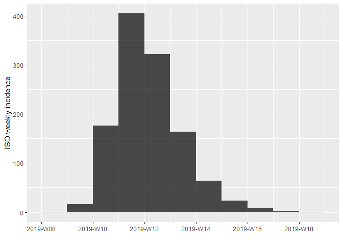

incidence also allows you to subset curves between start and end dates:


```r
plot(subset(outfluenza1.i,from=outfluenza1$x[1],to=outfluenza1$x[100]))
```

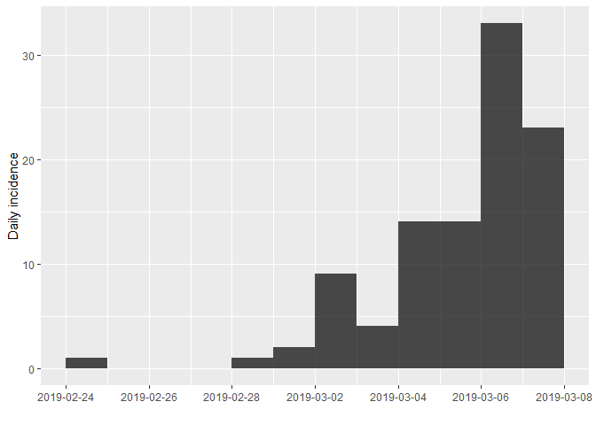

<div class="panel panel-default"><div class="panel-heading"> Task </div><div class="panel-body"> 
What is the significance of choosing the dates to subset in this way? </div></div>

<button id="displayTextunnamed-chunk-185" onclick="javascript:toggle('unnamed-chunk-185');">Show: Solution</button>

<div id="toggleTextunnamed-chunk-185" style="display: none"><div class="panel panel-default"><div class="panel-heading panel-heading1"> Solution </div><div class="panel-body">
We have limited the graph to only plot the first 100 cases. We achieved this by using the date of the 100$^{th}$ entry of the line list (outfluenza1$x) to set the upper limit.</div></div></div>

The `cumulate()` function returns a the cumulative incidence curve:


```r
plot(cumulate(outfluenza1.i))
```


Finally, you can convert an incidence object to a data frame by using the cast function `data.frame()`:


```r
outfluenza1.df = data.frame(outfluenza1.i)
head(outfluenza1.df)
```

```
##        dates counts
## 1 2019-02-24      1
## 2 2019-02-25      0
## 3 2019-02-26      0
## 4 2019-02-27      0
## 5 2019-02-28      1
## 6 2019-03-01      2
```


## Final Size Method

Final size methods for $R_{0}$ are in themselves a whole field of research. In this practical we will consider the utility of the basic deterministic “first estimate” also known as the final size formula:

\begin{equation} 
    (\#eq:1)
R_{0} = -\frac{ln(1-z_{f})}{z_{f}}
\end{equation}

where $z_{f}$ is the total fraction of the population infected at the end of an epidemic in a closed population.

<div class="panel panel-default"><div class="panel-heading"> Task </div><div class="panel-body"> 

Write a function `R0final` that returns the value of $R_{0}$ for a given value of $z_{f}$. Is there any restriction on the values that $z_{f}$ can take for the final size equation to be valid? Your function should check that $z_{f}$ takes a valid value and return a missing value (NA) when the final size equation is not defined.
 </div></div>

<button id="displayTextunnamed-chunk-189" onclick="javascript:toggle('unnamed-chunk-189');">Show: Solution</button>

<div id="toggleTextunnamed-chunk-189" style="display: none"><div class="panel panel-default"><div class="panel-heading panel-heading1"> Solution </div><div class="panel-body">

```r
R0final <- function(zf) {
    # zf must be proportion between 0 and 1
    # Trap for division by zero(zf=0.0)
    # Trap for log(1) (-Inf)
    if(zf<=0 || zf>=1.0) {
        return(NA)
    } else {
        return(-log(1-zf)/zf)
    }
}
```
</div></div></div>

This formula is more commonly used to predict the final size ($z_{f}$) of an epidemic once we have an independent estimate of $R_{0}$. This is less straightforward as we cannot solve equation \@ref(eq:1) explicitly for $z_{f}$. We can progress by rewriting \@ref(eq:1) into a problem we can solve numerically:


\begin{equation} 
    (\#eq:2)
R_{0} + \frac{ln(1-z_{f})}{z_{f}} = 0
\end{equation}

We can find the final size ($z_{f}$) corresponding to a given value of $R_{0}$, by solving for the value(s) of $z_{f}$ for which \@ref(eq:2) is equal to zero. Finding the roots of a function is a common problem, so it should not surprise you that there is a R function to do the job. `uniroot` uses an numerical procedure to estimate the roots of an arbitrary function `f` within a fixed `interval=c(lower,upper)`. We can use `uniroot` to write a function that returns the predicted final size for a given value of $R_{0}$:


```r
FinalSize <- function(R0) {
    return(uniroot(function(zf)
        {R0+log(1-zf)/zf},
        interval=c(.Machine$double.xmin,1.0))$root)
}
```

Check this function works by trying these test values on the R terminal:


```r
FinalSize(1.2)
```

```
## [1] 0.3136976
```

```r
FinalSize(1.0)
```

```
## [1] 6.126547e-05
```

```r
FinalSize(0.9)
```

```
## [1] -6.103516e-05
```

The exact values may differ slightly between versions of R on different machines.


<div class="panel panel-default"><div class="panel-heading panel-heading2"> Note: </div><div class="panel-body"> 

Numerical methods are only accurate up to a specified precision or **tolerance**. This is fundamentally limited by the precision with which real numbers can be represented on a computer (that naturally works with integer or binary numbers). `.Machine$double.xmin` is the smallest number (or difference between two numbers) that can be stored in a given version of R. This value may change between versions and on different computer platforms (Windows, Mac OS, Linux…)
 </div></div>

<div class="panel panel-default"><div class="panel-heading"> Task </div><div class="panel-body"> 

Use the auxiliary functions of the incidence package and these new functions you have just written to estimate $R_{0}$ for the exemplar outfluenza and biggles outbreaks. (Remember the school size for all of these outbreaks was 1300 children.)
 </div></div>

<button id="displayTextunnamed-chunk-194" onclick="javascript:toggle('unnamed-chunk-194');">Show: Solution</button>

<div id="toggleTextunnamed-chunk-194" style="display: none"><div class="panel panel-default"><div class="panel-heading panel-heading1"> Solution </div><div class="panel-body">

```r
R0final(incidence(outfluenza1$x)$n/1300)
```

```
## [1] 2.646094
```

```r
R0final(incidence(outfluenza2$x)$n/1300)
```

```
## [1] 2.378981
```

```r
R0final(incidence(biggles$x)$n/1300)
```

```
## [1] 2.463143
```
</div></div></div>


## Regression Method

In the lectures we discussed how the early phase of an epidemic can be approximately modelled by an exponential growth model:

\begin{equation} 
    (\#eq:3)
I(t) = I(0)e^{\Lambda t}
\end{equation}

where the exponential rate can be related to $R_{0}$ with the functional form depending on the structure of the epidemic model (in particular with respect to the distribution of latent and infectious periods). If we take logs of both sides of equation \@ref(eq:3) and rearrange we get the equation of a straight line:

\begin{equation} 
    (\#eq:4)
log(I(t)) = \Lambda t + log(I(0))
\end{equation}

with y-intercept given by the constant $log(I(0)$ and slope $\Lambda$. So, we canp therefore obtain a first approximation to $R_{0}$ simply by estimating the slope of the (logged) epidemic curve.

In principle, estimating $R_{0}$ using this method could be as straightforward as plotting the incidence or cumulative incidence curve on logarithmic graph paper and fitting a “best-fit” line, or using the Solver in Excel. We can be a little more sophisticated and use the linear regression model (`lm`) function in R. `lm()` uses a least squares method, effectively optimising the fit of the straight line to minimise the squared error between the line and the data.

As the exponential approximation is only valid early in the epidemic, including data from the full epidemic curve would bias our estimate of $R_{0}$. As discussed in the lecture we will use the first 100 cases. For a given simulation we need to select all the data-points up to the 100^{th} case. We can achieve this by sub setting the incidence object as before:


```r
outflu1.sub<- data.frame(subset(outfluenza1.i,from=outfluenza1$x[1],to=outfluenza1$x[100]))
```

We fit a linear model (best straight line fit) to find the slope of the log cumulative cases as described in the lectures:


```r
# Fit straight line to plot of biggles$t (time) and log of the cumulative cases (C)

outflu1.fit = lm(log(1+counts) ~ dates, data=outflu1.sub)
```

<div class="panel panel-default"><div class="panel-heading panel-heading2"> Note: </div><div class="panel-body"> 

We add 1 to counts to handle any zero cases (this should not affect the estimated slope).
 </div></div>

We can see the result of the regression by using the `summary` function:


```r
summary(outflu1.fit)
```

```
## 
## Call:
## lm(formula = log(1 + counts) ~ dates, data = outflu1.sub)
## 
## Residuals:
##     Min      1Q  Median      3Q     Max 
## -0.7081 -0.3553 -0.1211  0.3675  0.9870 
## 
## Coefficients:
##               Estimate Std. Error t value Pr(>|t|)    
## (Intercept) -5.996e+03  7.855e+02  -7.633 1.77e-05 ***
## dates        3.340e-01  4.374e-02   7.635 1.77e-05 ***
## ---
## Signif. codes:  0 '***' 0.001 '**' 0.01 '*' 0.05 '.' 0.1 ' ' 1
## 
## Residual standard error: 0.5231 on 10 degrees of freedom
## Multiple R-squared:  0.8536,	Adjusted R-squared:  0.8389 
## F-statistic:  58.3 on 1 and 10 DF,  p-value: 1.768e-05
```

<div class="panel panel-default"><div class="panel-heading"> Task </div><div class="panel-body"> 

The `summary()` function provides a lot of detailed information on the statistical fit of the regression line – for the purpose of estimating $R_{0}$ the key value is the estimated slope highlighted in bold above. Using the expression for the SIR model presented in the lectures calculate the $R_{0}$ of outfluenza using this slope:
 </div></div>

<button id="displayTextunnamed-chunk-200" onclick="javascript:toggle('unnamed-chunk-200');">Show: Solution</button>

<div id="toggleTextunnamed-chunk-200" style="display: none"><div class="panel panel-default"><div class="panel-heading panel-heading1"> Solution </div><div class="panel-body">

$R_{0} = 1 + 0.335*5 = 2.67$
</div></div></div>

We can estimate the uncertainty in our estimate of $R_{0}$ from the uncertainty in our estimate of the slope from the linear regression. The R function `confint()` will calculate 95% confidence intervals for our regression model:


```r
confint(outflu1.fit)
```

```
##                     2.5 %        97.5 %
## (Intercept) -7745.8850733 -4245.5519457
## dates           0.2365213     0.4314554
```

<div class="panel panel-default"><div class="panel-heading"> Task </div><div class="panel-body"> 

Use these confidence intervals to calculate a 95% confidence interval for your estimate of $R_{0}$.
 </div></div>

<button id="displayTextunnamed-chunk-203" onclick="javascript:toggle('unnamed-chunk-203');">Show: Solution</button>

<div id="toggleTextunnamed-chunk-203" style="display: none"><div class="panel panel-default"><div class="panel-heading panel-heading1"> Solution </div><div class="panel-body">

$R_{0} = 2.67$ (95% CI, 2.1 - 3.1)
</div></div></div>

The incidence package has built in functions that simplify estimating the exponential growth rate. The base function is `fit` returns an `incidence_fit` object which returns details of the fit including the estimated exponential growth rate r and the confidence interval:


```r
outflu1.fit2 <- fit(outfluenza1.i)

outflu1.fit2
```

```
## <incidence_fit object>
## 
## $model: regression of log-incidence over time
## 
## $info: list containing the following items:
##   $r (daily growth rate):
## [1] -0.0504102
## 
##   $r.conf (confidence interval):
##            2.5 %      97.5 %
## [1,] -0.06954703 -0.03127338
## 
##   $halving (halving time in days):
## [1] 13.75014
## 
##   $halving.conf (confidence interval):
##         2.5 %   97.5 %
## [1,] 9.966597 22.16413
## 
##   $pred: data.frame of incidence predictions (57 rows, 5 columns)
```

<div class="panel panel-default"><div class="panel-heading"> Task </div><div class="panel-body"> 

Why does `fit` ignore dates with 0 incidence?
 </div></div>

<button id="displayTextunnamed-chunk-206" onclick="javascript:toggle('unnamed-chunk-206');">Show: Solution</button>

<div id="toggleTextunnamed-chunk-206" style="display: none"><div class="panel panel-default"><div class="panel-heading panel-heading1"> Solution </div><div class="panel-body">

We are fitting a log-linear relationship and $log(0)$ is undefined.
</div></div></div>

The estimated $r$ is much lower than we obtained by our manual estimate. To see what has happened we can add the obtained fit to a plot of the incidence:


```r
plot(outfluenza1.i, fit= outflu1.fit2)
```


We can use the `subset` function to limit our fit to the first 100 cases as before:


```r
outflu1.sub = subset(outfluenza1.i,from=outfluenza1$x[1],to=outfluenza1$x[100])

outflu1.fit3 = fit(outflu1.sub)

plot(outflu1.sub,fit=outflu1.fit3)
```

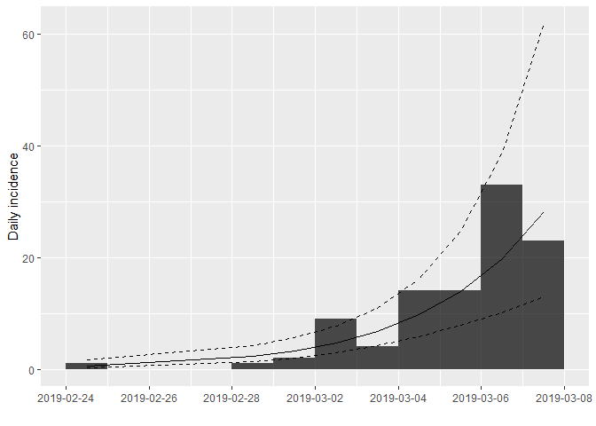

<div class="panel panel-default"><div class="panel-heading"> Task </div><div class="panel-body"> 

How do the estimates from the incidence package and our manual estimate compare to each other and why (what’s different)?
 </div></div>

<button id="displayTextunnamed-chunk-210" onclick="javascript:toggle('unnamed-chunk-210');">Show: Solution</button>

<div id="toggleTextunnamed-chunk-210" style="display: none"><div class="panel panel-default"><div class="panel-heading panel-heading1"> Solution </div><div class="panel-body">

`outflu1.fit2` is clearly a poor fit to the exponential growth rate as we have not subsetted the data to the exponential phase. The point estimates from the incidence package and our manual estimate are pretty comparable, however the confidence intervals from our manual estimate are smaller (0.2-0.4 compared to 0.2-0.5) reflecting the effective **smoothing** we applied to the data by using the cumulative case counts instead of raw incidence. We could similarly smooth the time series by increasing the time interval to sum up incidence - this runs the risk of introducing **artifacts** to the data or giving us false confidence in our estimates.
</div></div></div>

The incidence package provides a method for automatically sub setting the data by finding the optimum fit of two log-linear models (minimising the squared error of both):


```r
outflu1.fit5 = fit_optim_split(outfluenza1.i)
plot(outfluenza1.i,fit=outflu1.fit5$fit)
```


<div class="panel panel-default"><div class="panel-heading panel-heading2"> Note: </div><div class="panel-body"> 

The output of `fit_optim_split` now continues information on the two log-linear model fits, the first for the attack of the epidemic, the second describing the decay after the epidemic peak (which is also estimated as the **changepoint** between the two models).
 </div></div>

Examine the output by entering into the R console:


```r
outflu1.fit5
```

Which should also generate a plot of the mean r squared error (R2) of the two log-linear models against different dates for the changepoint:


## RECON earlyR method

Finally we will use the earlyR package implementation of the Tuenis and Wallinga method to estimate $R_{0}$ and compare to the other methods. The key function of the earlyR package is the `get_R` function that returns an estimate of $R_{0}$ when passed an incidence object and a serial interval distribution. The serial interval can be specified manually, but we will use the default gamma distribution which is parameterised by the mean (`si_mean`) and standard deviation (`si_sd`). For outfluenza, the serial interval distribution is exponentially distributed with mean equal to the variance (si_mean $= 5$, si_sd $= 5$).


```r
library(earlyR)
estR = get_R(outfluenza1.i,si_mean=5,si_sd=5)
estR
```

```
## 
## /// Early estimate of reproduction number (R) //
##  // class: earlyR, list
## 
##  // Maximum-Likelihood estimate of R ($R_ml):
## [1] 1.001001
## 
## 
##  // $lambda:
##   NA 0.1812692 0.1484107 0.1215084 0.09948267 0.2627188...
## 
##  // $dates:
## [1] "2019-02-24" "2019-02-25" "2019-02-26" "2019-02-27" "2019-02-28"
## [6] "2019-03-01"
## ...
## 
##  // $si (serial interval):
## A discrete distribution
##   name: gamma
##   parameters:
##     shape: 1
##     scale: 5
```

Once again we have obtained a much lower estimate of $R (R_{0}=1.0)$ than expected as the earlyR method is only valid during the exponential phase of the epidemic. If we subset again using the first 100 cases you should obtain a more consistent estimate of $R_{0}$ of 2.43.

We can calculated a boostrapped 95% confidence interval for the estimate using the `sample_R` function:


```r
quantile(sample_R(estR),c(0.025,0.975))
```

```
##     2.5%    97.5% 
## 0.960961 1.071071
```

So our earlyR estimate of $R_{0} = 2.43$ (2.0-3.0, 95% CI).

<div class="panel panel-default"><div class="panel-heading"> Task </div><div class="panel-body"> 

Now we have introduced all of the methods, let’s compare the estimates (and confidence intervals where possible) of $R_{0}$ for our three exemplar outbreaks. Complete the following table by adapted the code you have used in the practical.

Remember that for Outfluenza the mean serial interval is 5 days (standard deviation 5 days). For Biggles the latent period is 5 days, the exposed period is 5 days. As discussed in lectures, adding two exponentially distributed variables together gives a gamma distributed variable. So the serial interval for Biggles will be gamma distributed with a scale parameter of 10 days and a shape parameter of 2, giving a mean serial interval of 10 and standard deviation of $5\sqrt{2}$. *(Ask your instructor for more details if interested!)*

| Outbreak | Regression r | Regression $R_{0}$ | Final Size $R_{0}$ | earlyR $R_{0}$ |
|---|---|---|---|---|
| Outfluenza1 |  |  |  |  |
| Outfluenza2 |  |  |  |  |
| Biggles |  |  |  |  |
 </div></div>

<div class="panel panel-default"><div class="panel-heading"> Task </div><div class="panel-body"> 

Compare your estimates from the three methods of estimation. Are you surprised by the variability in estimates of $R_{0}$ that you have obtained compared to the size of the 95% confidence intervals of the estimates?
 </div></div>

<button id="displayTextunnamed-chunk-219" onclick="javascript:toggle('unnamed-chunk-219');">Show: Solution</button>

<div id="toggleTextunnamed-chunk-219" style="display: none"><div class="panel panel-default"><div class="panel-heading panel-heading1"> Solution </div><div class="panel-body">

The confidence intervals from our regression model capture the variability (scatter) in the model output around the best-fit line for this particular realisation of the epidemic model. Stochastic effects will generate far greater variability between realisations, which our linear model contains no information about. The uncertainty in the estimate of the slope will therefore typically underestimate the true variability in the epidemic model. The Likelihood function for the earlyR method includes more information on the variability of the serial interval derived from an epidemic model and better represents the true **uncertainty** in our estimates.
</div></div></div>

## Appendix

You might be interested now in explore how well the final size and regression estimators perform on different stochastic replicates of the SIR or SEIR models.

“SIRmodels.R” and “SEIRmodels.R” provide functions to allow you to generate your own simulated epidemics of Biggles and Outfluenza.

To load the functions into the R workspace using the following R code:


```r
source('SIRmodels.R')
source('SEIRmodels.R')

N = 1300
```


“SIRmodels.R” provides two familiar functions:


`DetSIR.dyn`

Uses the internal R function `lsoda()` to numerically solve the **deterministic** SIR model given 5 parameters:

- N: Population size
- I0: Initial infected
- B: transmission rate
- M: “recovery” rate = $1/T_{I}$ corresponding to average infectious period of $T_{I}$
- f_time: run time for numerical solution

`create.StocSIR` defines an stochastic SIR model to use with the SimInf package and takes 6 arguments:

- N: Population size
- I0: Initial infected
- beta: transmission rate
- m: “recovery” rate = $1/T_{I}$ corresponding to average infectious period of $T_{I}$
- f_time: run time for numerical solution
- reps: number of replicates to simulate


“SEIRmodels.R” provides equivalent functions `DetSEIR.dyn` and `StocSEIR.dyn` that implement the deterministic and stochastic SEIR epidemic model respectively.

Both of these functions implementing the SEIR model take 7 parameters in the order that follows:

- N: Population size
- I0: Initial infected
- E0: Initial exposed
- B: transmission rate
- G: “progression” rate = $1/T_{E}$, with average exposed period of $T_{E}$
- M: “recovery” rate = $1/T_{I}$ corresponding to average infectious period of $T_{I}$
- f_time: run time for numerical solution

The deterministic equations for the SEIR are then:

$$\begin{aligned} \frac{dS}{dt} &= -\frac{\beta SI}{N} \\ \frac{dE}{dt} &= \frac{\beta SI}{N} - gE \\ \frac{dI}{dt} &= gE -mI \\ \frac{dR}{dt} &= mI \end{aligned}$$

You can check this new code for the deterministic SEIR model by simulating an epidemic using the Biggles parameters from the lecture and comparing to the figures in the lecture notes:


```r
# Biggles Examplar Epidemic
det.sol<-DetSEIR.dyn(1300, 1,0, 0.5, 1/5.0, 1.0/5.0, 150)
matplot(det.sol[,1],det.sol[,2:5],type='l',xlab='Days',ylab='Population',lwd=2)
```


Checking the stochastic model is more difficult as the output will be different every time we run it! As a first sanity check we can compare stochastic simulations to the deterministic epidemic, checking that they (roughly) scatter evenly around the “mean” behaviour:


```r
SEIRmodel <- create.StocSEIR(1300, 1, 0, 0.5, 1.0/5.0, 1/5.0, 150,1)
out <- run(model=SEIRmodel)
plot(out)
```

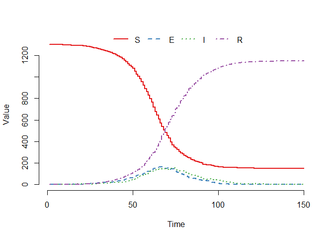

To simplify working with the incidence package we also provide a wrapper function `line_list()` that takes a SimInf object (out) as argument, along with a numeric value (node) and returns a line list of dates of cases for specified node:


```r
SEIRmodel <- create.StocSEIR(1300, 1, 0, 0.5, 1.0/5.0, 1/5.0, 150,100)
out <- run(model=SEIRmodel)
line_list(out,1)
```


<!--chapter:end:Materials/BYOM/Estimating_R0.Rmd-->

# Seasonality and Measles Epidemics

## Measles data and challenge

You have been asked to implement a determinsitic model to predict the impact of vaccination on the timing of outbreaks of measles in London. You have been asked to make a number of assumptions to proceed:

* Constant population size of 3.3 million
* Birth rate of 20 per thousand per year
* Basic reproduction number $R_{0} = 17$ (for sinusoidal forcing model)
* Cases can be approximately calculated from the number of infectives by multiplying by 7/5 (i.e. reporting period /average infectious period)

You were provided with a time-series of measles cases from London from 1950-1964 (immediately prior to the introduction of vaccination in the UK) and asked to assume that the reporting rate at this time was 40%. 

These data are included as part of the `tsiR` package in R that provides historical time-series data from England and Wales along with functions to work with the so-called time-series SIR model (TSIR) - a discrete time chain binomial model that can be used to very successfully model and predict measles dynamics (and to a lesser extent other strongly immunizing childhood infections).

The "plotdata" function from the `tsiR` package provides a summary of the incidence and demographic data (birth rates and population size):

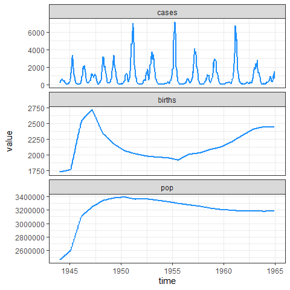

As you can see, our simplifying assumption of fixed birth and population size glosses over the "baby boom" post **WWII** that pushed the typical two-year cycle of measles epidemics into annual outbreaks and led (along with migration) to an increase in the population size. The TSIR model can be used to estimate the seasonal variation in transmission rates presented in the background slides (on which we overlay the typical pattern of school terms in England and Wales calculated by the mk_terms function below):


```
##            alpha        mean beta         mean rho         mean sus 
##         9.60e-01         1.19e-05         4.57e-01         1.14e+05 
## prop. init. sus. prop. init. inf. 
##         3.01e-02         6.12e-05
```

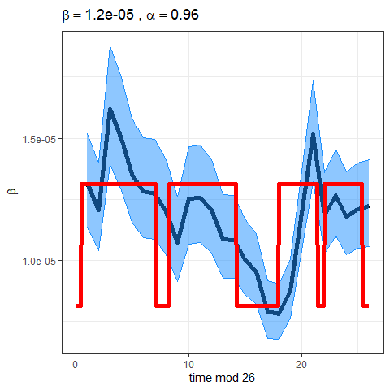

Important to note that the estimated transmission parameters from the TSIR model **do not** translate directly to the transmission parameters for continuous-time (ordinary differential or stochastic) models. The qualitative pattern is informative rather than the specific estimates. (Conceptually I would consider these estimates to be closer to reproduction numbers than transmission rates as they are usually presented.). Note alsoe that the $\alpha$ used in the TSIR model is not an amplitude of seasonality but a correction (i.e. fudge) factor for the density dependence of the transmission term which - in some sense - can be used to adjust for artificts arising from the discrete time approximation.

We also provided you with hope-simpon's estimates of the serial interval of measles and illustrated that it suggests that the latent and infectious periods of measles are less dispersed (less variable) than exponential and well described by a gamma distribution where the shape and scale parameters are approximately equal:

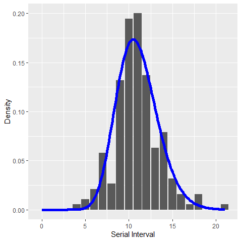


## Standard SEIR (exponential) with sinusoidal forcing

We first present an implementation of the standard SEIR model - withc constant rates of progression through the latent and infectious compartments - and sinusoidal forcing term. The basic template here is similar to what you have seen before in earlier practicals except that the transmission rate now depends on the time. Here we wrote a wrapper function which set's some sensible default initial conditions (the fixed points of the unforced SEIR model where $\alpha=0.0$) and then runs the model for three periods. No matter the inital model conditions the seasonally forced SEIR model will **eventually** converge towards a stable dynamic behaviour (often described as an "attractor" in analogy to the fixed points of an unforced model). We can run the model for a "burn-in" period (analogous to the same concept for MCMC convergence) to remove this "transient" behaviour. Our function solves the model for three periods. We forward-simulate the initial conditions for "burnin" years discarding the results but using the final state to set the initial conditions for a run of "prevacc" years. We then adjust the birth rate to model vaccination at birth and then run for an additional postvacc years, returning a tibble with the sampling times and state variables of the model:


Using the suggested parameter values you should find that a seasonal forcing of $\alpha = 0.19$ gives a reasonable qualitative fit to the two year cycle of measles oubtreaks seen in London after 1950:


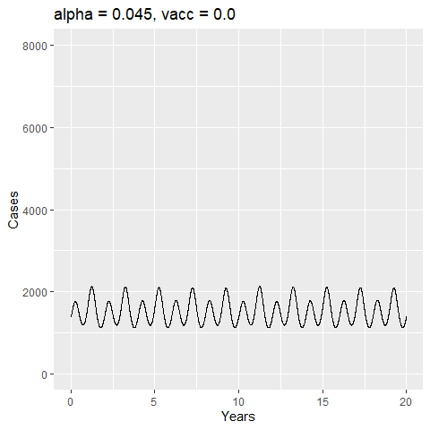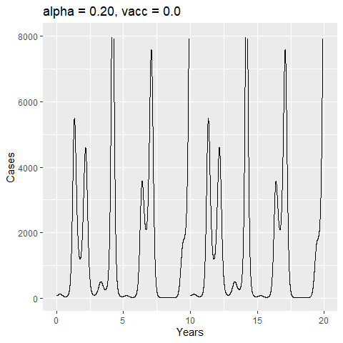

For sinusoidal forcing the bifurcation to two-yearly cycles occurs for a very small amount of seasonal forcing ($\alpha \sim 0.02$) with the amplitude of the two-year cycle increasing with increasing $\alpha$ before further bifurcations to three, four and irregular multiannual cycles.

If we now examine the effect of increasing vaccination coverage we see that at low coverage vaccination progressively increases the time between outbreaks - shifting cycles to 3,4 and higher (irregular cycles). However, the incidence between outbreaks now falls to unrealistically low levels (nano-scale number of infectives!) - highlighting the likely increased importance of stochastic effects after the introduction of vaccination. 

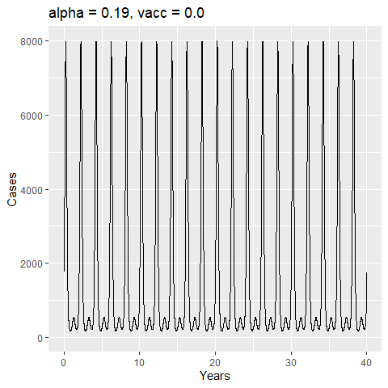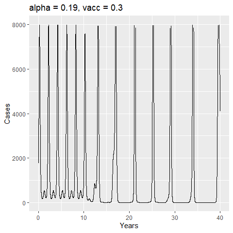


<div class="panel panel-default"><div class="panel-heading panel-heading2"> Note: </div><div class="panel-body"> 
These types of models can be very sensitive to both initial conditions and numerical errors meaning that more sophisticated numerical methods (such as AUTO) need to be used to map out the full range of dynamical behaviours accurately. </div></div>


## Standard SEIR (exponential) with term-time forcing

We now adapt the previous code to use a term-time forcing function and run the same model scenarios:


The term-time forcing function leads to a very different (and richer) bifurcation structure. Indeed, if you tried this form of the model you likely could not find values of $\alpha$ that gave a reasonable match to the London time-series for the assumed parameter values. Reducing the assumed value of $R_{0}$ to 12 you can achieve a comparable fit (arguably better with respect to the qualitative shape of the attractor).


We see the same qualiative impact of vaccination as before, but note that the higher troughs in prevalence between major outbreaks predicted by the term-time forcing model mean that stable (and plausible in terms of depth of trough between outbreaks) dynamics are seen for a wider range of birth/vaccination rates:


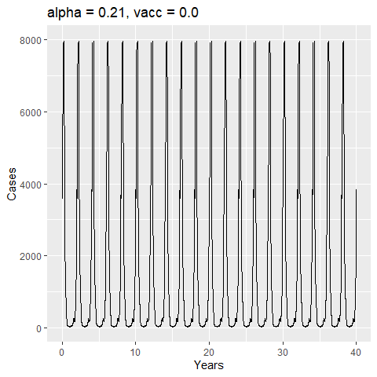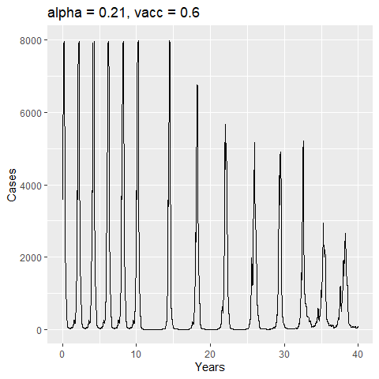

## Gamma SEIR with term-time forcing

Finally, we present an implementation of the term-time forcing model with realistic (gamma) distributed latent and infectious periods. The Gamma-SEIR model is much more sensitive to changes in the forcing amplitude $\alpha$ requiring lower amplitudes to generate the same qualitative dynamics as the (less biologically accurate) standard model with constant rates. These models are even more difficult to work with numerically and presented here purely for completeness and a cautionary note on the extent to which these model assumptions impact on the range of model parameters that will be consistent with real data. This sensitivity - and strong tradeoffs between transmission rates, birth rates and distributional assumptions makes this type of model particular problematic (and therefore particulary interesting) to perform inference with.


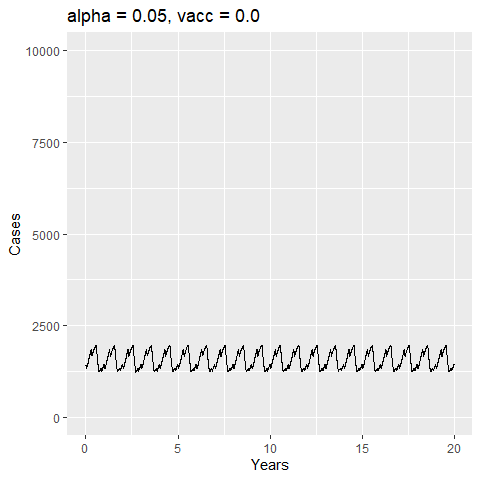

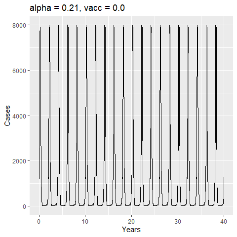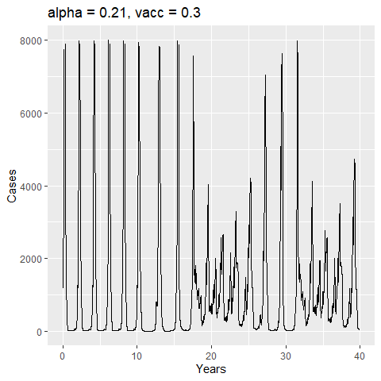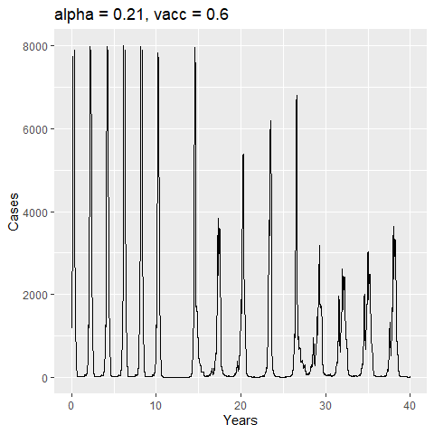


<!--chapter:end:Materials/BYOM/Measles.Rmd-->

# Outbreak of influenza in a boarding school

## Data Summary and challenge

We will build and roughly calibrate a transmission model to describe the outbreak of influenza in a English boarding school we first met in the stochastic modelling practical.

For the purposes of this practical we assume that the numbers of pupils in bed measure the numbers infectious on each date. Not a great assumption as they are to an extent self-isolating, but also not terrible given the relatively short latent and (effective) infectious period for influenza ($\sim 1$ day).

We are asked to model the likely impact on the outbreak should 80% of the boys have been vaccinated before the start of the outbreak with a vaccine with 50% (direct) protection from infection. For a single outbreak reasonable to neglect the potential for loss of immunity to reinfection so modelling vaccination in this case only amounts to changing the **initial conditions** of the model (i.e. the number susceptible and recovered when infection is introduced.) We are told to assume an exposed period of 1 hour and an infectious period of 2 days so a standard SEIR compartmental model should be sufficient. We will first address the question using a deterministic and stochastic model in turn.


## Deterministic model

For the standard SEIR model with constant rates of progression through the exposed and infectious compartments an $R_0$ of $\sim 4.0$ gives a rough calibration to the observed data (black points and lines):


This rough calibration does not hold up if we now vary the distributional assumption for the latent and infectious periods. The supplied code has implemented the SEIR model with gamma distributed (strictly an erlang distribution were the shape parameter is an integer) latent and infectious periods. If we vary the shape parameters for I and E we see that the peak prevalence and initial rate of exponential growth are very sensitive to changes in the distribution. Less dispersed distributions (i.e. higher shape parameters) have sharper epidemics with higher peak prevalence. The final size (and approximate value of R0) on the other had are insensitive to these changes. Below we plot a set of three curves below for shape parameters = 10 illustrating that we now require a lower value of $R_{0}$ to (roughly) match the data. The fit is not as good as I deliberately picked the average infectious and latent periods to give a reasonable fit with the exponential model...


In practice the latent and infectious period distributions are not identifiable purely from a single epidemic curve. As this very simple comparison demonstrates calibrating our model based on the wrong assumption can lead to a significant under or over estimate of $R_{0}$.

## Stochastic model

The rough calibration we identified using the deterministic model mostly holds up for the stochastic model with replicates scattering around the observed numbers. Although the population is small, the transmission rate is relatively high ($R_{0}=4$) so the deterministic model is a reasonable approximation for the average of the stochastic simulations. If the transmission rate was lower this would not necessarily be the case. 


The main reason for considering a stochastic model for this question is then to quantify how vaccination changes the chances of seeing an outbreak at all. We can calculate this from our simulated scenarios by calculate the mean number of simulations that have more than one infection ( mean(outbreak) in table below) or compare the final size distribution for the two scenarios.


```
## # A tibble: 2 x 2
##   vacc  `mean(outbreak)`
##   <lgl>            <dbl>
## 1 FALSE             0.75
## 2 TRUE              0.36
```


<!--chapter:end:Materials/BYOM/Influenza.Rmd-->

